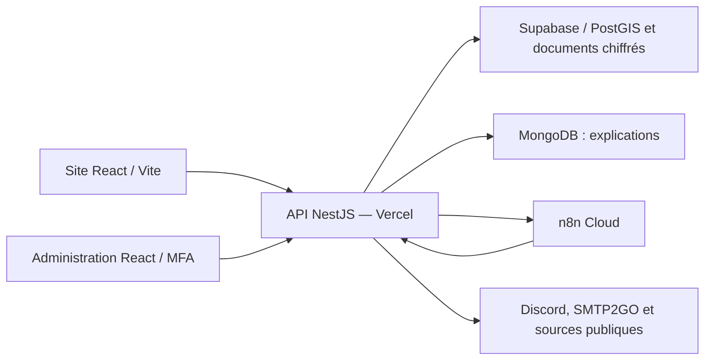

# InfiMatch

Plateforme étudiante de mise en relation entre professionnels de santé, établissements et agences d'intérim. Le projet comprend une application web, une API, une administration séparée et des automatisations n8n.

InfiMatch facilite la recherche et le suivi des missions. Les agences assurent l'emploi et la rémunération. Les PDF produits sont des confirmations ou annulations applicatives, pas des contrats de travail complets signés.

## Accès en production

**[Ouvrir l’application InfiMatch](https://infimactch-prod-backend-l5bc.vercel.app)**

| Service | Adresse |
| --- | --- |
| Application publique | https://infimactch-prod-backend-l5bc.vercel.app |
| Administration (compte administrateur et MFA requis) | https://infimatch-admin.vercel.app |
| État de santé de l’API | https://infimactch-prod-backend.vercel.app/api/v1/health |

Les espaces personnels nécessitent une connexion. Les liens de production ont été vérifiés le 24 septembre 2026 (HTTP 200).

## Accès rapide

| Besoin | Document |
| --- | --- |
| Périmètre et critères d'acceptation | [Exigences du projet](docs/REQUIREMENTS_V1.md) |
| Préparer le rendu Epitech | [Livrables et recette finale](docs/rendu/README.md) |
| Trouver un guide technique | [Index documentaire](docs/README.md) |
| Comprendre les services déployés | [Déploiement](docs/DEPLOIEMENT_PRODUCTION.md) |
| Retrouver un ancien document | [Politique d'archivage](docs/ARCHIVES.md) |

## Fonctionnalités

- Inscription et connexion des candidats, établissements et agences ; profils et droits distincts.
- Qualifications, vérification RPPS, disponibilités et zone de recherche enregistrée.
- Création et publication directe des annonces depuis « Missions et suivi », pour les établissements et les agences.
- Recherche de missions, favoris, candidatures et matching explicable ; affectation après décision humaine.
- Agenda, documents privés et confirmations/annulations PDF.
- Notifications internes ; configuration Discord facultative après inscription et modifiable ensuite. Emails selon les services configurés.
- Import et nettoyage d'offres externes, contrôle des doublons, reprises et quotas.
- Administration : rôles, MFA, suivi des comptes, incidents, imports et journaux.

Le RIB reste facultatif. Pour la démonstration scolaire, DEMO_OPTIONAL_RPPS=true permet de candidater et d’affecter sans RPPS vérifié ; le statut du profil reste inchangé. Le contrôle strict est appliqué si ce réglage est absent ou vaut false. Le domicile et la zone de recherche/alertes sont distincts ; une recherche ponctuelle ne modifie pas les alertes enregistrées. Une correspondance RPPS ne certifie pas à elle seule l'identité du titulaire.

## Architecture



[Architecture détaillée et schéma imprimable](docs/SCHEMA_ARCHITECTURE_V1.md) · [Flux métier et sécurité](docs/FLUX_V1.md) · [Automatisations, horaires et preuves](docs/AUTOMATISATIONS.md).

Le backend porte les règles métier ; n8n orchestre les appels. La reprise périodique est réglée sur quatre heures, en complément des tentatives immédiates après certaines écritures. Les trois applications Vercel sont déployées séparément.


| Composant | Technologie / rôle |
| --- | --- |
| Application et administration | React 19, TypeScript, React Router, Vite ; builds séparés |
| API | NestJS, Node.js 24, TypeScript |
| Données structurées et géographie | PostgreSQL / PostGIS ; Supabase en production |
| Explications du matching | MongoDB |
| Automatisations | Workflows n8n et traitements backend |
| Documents | Chiffrement applicatif et stockage configuré côté serveur |

```text
backend/       API, règles métier, migrations et tests
frontend/      Application, administration et tests navigateur
infra/         Environnement local et configuration d'infrastructure
scripts/       Validation, imports, exploitation et sauvegardes
workflows/     Modèles de workflows n8n
docs/         Guides, exigences, preuves et préparation du rendu
```

## Installation locale

Prérequis : Node.js 24, npm, Git et Docker avec Compose (Docker démarré). Les commandes ci-dessous fonctionnent dans PowerShell et dans un terminal Linux/WSL. Les exécuter depuis la racine du clone, sauf indication contraire.

### Première installation

```sh
npm ci
npm ci --prefix frontend
npm run setup
```

Avant de continuer, ouvrir le fichier `.env` créé à la racine et vérifier ces réglages :

```dotenv
NODE_ENV=development
PORT=3100
APP_ORIGIN=http://127.0.0.1:5173
ADMIN_ORIGIN=http://127.0.0.1:5175
DEMO_OPTIONAL_RPPS=false
```

`APP_ORIGIN` est l’origine du navigateur, pas celle de l’API. Utiliser `127.0.0.1` pour ouvrir l’application et l’administration : mélanger `localhost` et `127.0.0.1` provoque des différences d’origine et peut bloquer les sessions/CSRF. Vite transmet `/api` à `http://127.0.0.1:3100`. Ne pas désactiver les contrôles CSRF pour contourner une mauvaise configuration.

Pour une démonstration scolaire sans RPPS vérifié, choisir explicitement `DEMO_OPTIONAL_RPPS=true`. Ce réglage ne vérifie pas le profil. `setup` conserve un `.env` existant : après une mise à jour du dépôt, corriger les origines manuellement et redémarrer l’API.

Vérifier que `DATABASE_URL` et `MONGODB_URI` ciblent les conteneurs locaux (ports 55432 et 57017). Les migrations, le seed et les tests d’écriture suivants ne doivent pas viser la production.

```sh
docker compose --env-file .env -f infra/compose.yaml --profile automation up -d
npm run db:migrate
npm run finess:import
npm run seed -w backend
npm run build
npm run start -w backend
```

Dans un deuxième terminal, à la racine :

```sh
npm run dev --prefix frontend
```

Dans un troisième terminal, à la racine :

```sh
npm run dev:admin --prefix frontend
```

| Service local | Adresse |
| --- | --- |
| Application | http://127.0.0.1:5173 |
| Administration | http://127.0.0.1:5175 |
| Santé API | http://127.0.0.1:3100/api/v1/health |
| OpenAPI interactif | http://127.0.0.1:3100/api/docs |
| n8n local | http://127.0.0.1:55678 |

### Premier administrateur local (OWNER)

Créer d’abord un compte dans l’application locale. Dans un autre terminal à la racine, remplacer l’adresse ci-dessous par celle de ce compte :

```sh
npm run admin:bootstrap:local -- votre-adresse@example.com
```

Cette commande utilise uniquement le `.env` de ce clone. Elle exige le mode développement et la base Docker locale `infimatch` sur le port 55432 ; elle refuse un second bootstrap si un administrateur existe déjà. Elle ne contacte pas Vault ni la production.

Ouvrir le fichier privé `data/admin/first-local-owner-invitation.json`, puis l’administration locale. Choisir « J’ai reçu une invitation », saisir l’adresse et le code, puis suivre la création du mot de passe administrateur et l’enrôlement MFA. Conserver les codes de secours. L’invitation expire après 24 heures ; aucun email d’invitation n’est envoyé automatiquement. Le fichier privé n’est pas à publier. Une fois connecté, inviter les autres administrateurs depuis l’interface.

Le bootstrap de production suit une [procédure distincte](docs/quality/ADMIN_PSC_EXPLOITATION.md).

### Démarrage quotidien

Conserver le `.env` et les volumes Docker. Après arrêt du poste, redémarrer les services, puis l’API :

```sh
docker compose --env-file .env -f infra/compose.yaml --profile automation up -d
npm run start -w backend
```

Ouvrir deux autres terminaux pour `npm run dev --prefix frontend` et `npm run dev:admin --prefix frontend`. Après modification du backend, relancer `npm run build`, ou utiliser `npm run dev` pour la recompilation automatique. Ne pas rejouer le seed ou le bootstrap OWNER à chaque démarrage. Après récupération de nouveaux commits, installer les dépendances si les fichiers lock ont changé et appliquer les nouvelles migrations locales avant de relancer l’API.

Pour arrêter les conteneurs sans effacer leurs données :

```sh
docker compose --env-file .env -f infra/compose.yaml --profile automation stop
```

### Automatisations et services externes

Le démarrage de n8n local ne configure pas ses workflows ni leurs connexions. Les imports externes, Discord et SMTP2GO nécessitent leurs propres identifiants et destinations. Voir les [automatisations](docs/AUTOMATISATIONS.md) et la [configuration des services](docs/quality/CONFIGURATION.md). L’application locale de base peut démarrer sans ces services ; leurs fonctions ne sont alors pas opérationnelles. Le worker `npm run worker`, après compilation, traite les événements de la base configurée : ne le lancer que lorsque les destinations locales sont vérifiées.

Le [guide frontend](frontend/README.md) complète les commandes de développement. Les documents référencés ici se trouvent dans `docs/` sur les deux branches principales ; `docs_intern/` appartient aux anciens états du dépôt Epitech.


## Validation

| Contrôle | Commande à la racine |
| --- | --- |
| Tests unitaires API | `npm test` |
| Compilation API | `npm run build` |
| Tests d'intégration | `npm run test:integration` |
| Couverture backend | `npm run coverage` |
| Tests frontend | `npm test --prefix frontend` |
| Typage frontend | `npm run typecheck --prefix frontend` |
| Build public | `npm run build --prefix frontend` |
| Build administration | `npm run build:admin --prefix frontend` |
| Recettes navigateur configurées | `npm run test:browser --prefix frontend` |
| Recette navigateur administration (après build admin) | `npm run test:admin --prefix frontend` |
| Contrôle local des secrets connus | `npm run check:secrets` |

Les intégrations utilisent des bases isolées ; préparer leur environnement avant exécution. Les recettes navigateur nécessitent leurs serveurs et fixtures. Le contrôle des secrets connus ne constitue pas un audit exhaustif de l'historique.

Contrôle documentaire et comparaison des branches : `python scripts/check-repository-consistency.py` ; ajouter `--compare CHEMIN_AUTRE_DEPOT` depuis la copie de production pour comparer chaque fichier et chaque ligne, en tenant compte des chemins documentaires propres à Epitech.

## État de livraison et limites

État documentaire : **24 septembre 2026**. Consulter en priorité [l’état courant du code, des documents et du déploiement](docs/ETAT_COURANT.md). Les versions applicatives vérifiées, les déploiements et les résultats CI sont regroupés dans [le registre de livraison](docs/rendu/LIVRAISON_VERIFIEE.json). Le manifeste du rendu identifie le commit effectivement remis. Une mise à jour documentaire ne constitue pas une nouvelle recette métier ; les preuves datées conservent leur périmètre.

- Optimisation du matching testée sur bases isolées ; résultats et comparaisons conservés.
- Étape Discord facultative testée sur les trois familles de comptes avec API fictive ; aucune réception Discord réelle n'en est déduite.
- Recette complète publiée, deux résultats nocode actuels, enrôlement MFA réel et essais humains d'accessibilité restent à documenter.
- Identité du responsable des données, certaines durées et heures humaines de l'équipe restent à formaliser.
- La CI Epitech était bloquée par le budget de l'organisation au dernier constat ; ne pas l'assimiler à une CI réussie.

Le [dossier de rendu](docs/rendu/README.md) distingue livrables disponibles et validations ouvertes. Aucune conformité RGAA complète ni économie financière/carbone n'est revendiquée.

## API et exploitation

Les routes métier utilisent `/api/v1`. Les écritures authentifiées nécessitent les protections de session, d'origine et CSRF prévues par le client. Les droits sont contrôlés côté serveur. L'[export OpenAPI](docs/openapi.json) complète la documentation servie par l'application.

Les variables `VITE_*` sont publiques : ne jamais y mettre de secret. L'administration, le site et l'API ont des livraisons distinctes. Voir [le déploiement](docs/DEPLOIEMENT_PRODUCTION.md), [les sauvegardes](docs/quality/SAUVEGARDES_OPERATIONNELLES_2026-09-19.md) et [les automatisations](docs/rendu/README.md#automatisations).

## Contribution et documentation

Conserver les tests et preuves adaptés au changement. Mettre à jour les exigences lorsqu'un comportement produit évolue. Ne pas placer conversations, prompts, comptes rendus successifs ou secrets dans les branches actives. Les guides décrivent l'usage courant ; les preuves datées décrivent uniquement leur campagne. Voir [les archives](docs/ARCHIVES.md).

Licence : [LICENSE](LICENSE).

[Guide utilisateur](docs/GUIDE_UTILISATEUR.md) · [Inventaire documentaire](docs/INVENTAIRE_DOCUMENTAIRE.md).

[Seconde vérification documentaire et réserves restantes](docs/VERIFICATION_DOCUMENTAIRE_2026-09-21.md).

La [revue du code du 21 septembre](docs/quality/REVUE_CODE_2026-09-21.md) décrit le nettoyage, les corrections et les limites des vérifications.
