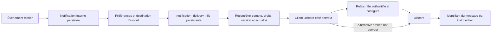

# Notifications internes et Discord

État documentaire au 24 septembre 2026. [Différence entre code préparé et production](ETAT_COURANT.md). Une configuration présente ne prouve pas une réception réelle.

## Parcours utilisateur

Les notifications internes sont accessibles dans `/notifications`. Après création du compte candidat, établissement ou agence, la configuration Discord est proposée avec une option pour passer cette étape. Discord reste facultatif ; l'inscription ne coche pas automatiquement les préférences de notification.

L'association personnelle vérifie un identifiant Discord par un code reçu en message privé. Lorsque l’utilisateur coche « Recevoir les notifications Discord » sans sélection préalable, tous les événements disponibles pour cette destination sont présélectionnés. Il peut en décocher avant de cliquer sur « Enregistrer les préférences ». Une sélection personnalisée existante est conservée ; l’association seule n’active toujours aucun envoi. Les salons d'organisation exigent les droits appropriés et une destination autorisée ; les préférences peuvent être modifiées après l'inscription. Le message de bienvenue initial reste interne. Les emails transactionnels et de récupération de mot de passe utilisent un mécanisme séparé : voir [les emails](EMAILS_LIVRAISON.md).

## Livraison et reprise

Le client choisit le bot direct si `DISCORD_BOT_TOKEN` est fourni ; sinon il utilise le relais HTTPS `DISCORD_RELAY_URL` avec `DISCORD_RELAY_TOKEN`. Le modèle [discord-relay.template.json](../workflows/discord-relay.template.json) ne contient pas les credentials réels.

Le traitement recontrôle les préférences et la validité de l'événement au moment de l'envoi. Une destination modifiée ou un événement périmé peut annuler une livraison. Les états `PENDING`, `SENDING`, `SENT`, `FAILED`, `UNCERTAIN` et `CANCELLED` distinguent attente, envoi, reçu et échec. Un résultat incertain ne doit pas être renvoyé aveuglément. La reprise après limitation de débit est bornée.

En production, les tentatives immédiates et la reprise cloud à quatre heures traitent une file bornée ; elles ne garantissent pas une livraison instantanée. En local, le worker peut traiter les files. Les règles métier restent côté API. Les services cloud courants ne nécessitent pas que le PC hébergeant Vault soit allumé.

## Extension des rappels préparée le 24 septembre

Le nouveau code autorise le repli d’un rappel d’organisation vers le message privé du membre actif si aucun salon d’organisation activé ne traite cet événement. Le DM doit lui-même être activé pour cet événement et respecter les préférences. Les choix existants ne sont pas modifiés automatiquement. Trois destinations personnelles étaient présentes lors de l’audit, aucune destination d’organisation ; leur présence ne signifie pas que les nouveaux événements y sont activés.

## Secrets et preuves

Les secrets restent dans Vault, les variables serveur et les credentials n8n autorisés. Aucun token dans `VITE_*`, Git ou une capture. Ne pas publier les identifiants personnels de destinataires comme exemples.

Pour une preuve de soutenance, associer un événement fictif à son exécution et à un message effectivement reçu. Les tests isolés ne prouvent pas une réception actuelle. [Automatisations](AUTOMATISATIONS.md), [configuration](quality/CONFIGURATION.md), [client Discord](../backend/src/notifications/discord-client.ts) et [file de livraison](../backend/src/notifications/notifications.module.ts).

## Vérification des réglages par défaut

La recette navigateur `frontend/scripts/test-discord-defaults.mjs` vérifie la sélection initiale, la sauvegarde explicite, la conservation des choix personnalisés et la séparation entre messages privés et salons d’organisation. Les API sont simulées : aucun message Discord réel n’est envoyé par ces tests.
