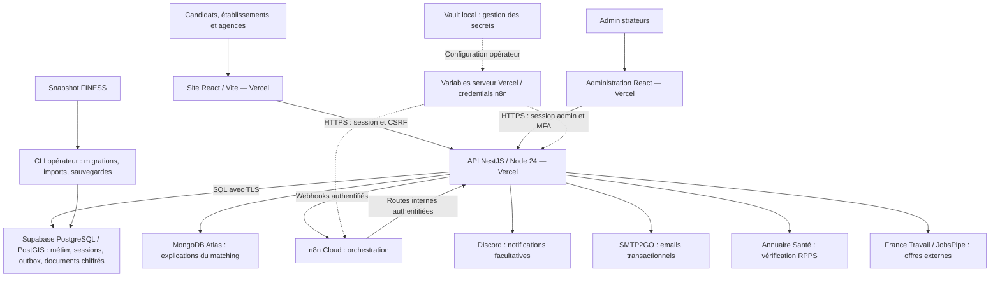
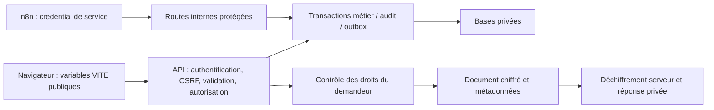

# Architecture technique InfiMatch

> Actualisation du 24 septembre : voir [l’état courant](ETAT_COURANT.md) pour les nouveaux rappels préparés, les tests et la différence avec la production. Les preuves datées ci-dessous conservent leur portée.
Référence documentaire au **21 septembre 2026**. Cette vue décrit les composants implémentés et l'inventaire de déploiement connu ; elle ne remplace pas une recette de production. InfiMatch est un projet de mise en relation : les agences emploient et rémunèrent.

Vue imprimable : [PNG](diagrams/architecture-infimatch-v1.png), [PDF](diagrams/architecture-infimatch-v1.pdf), [SVG](diagrams/architecture-infimatch-v1.svg). [Source Mermaid](architecture-v1.mmd). Les flèches représentent les appels logiques, pas une mesure du trafic.

## Composants et responsabilités

| Composant | Responsabilité | Limite / protection |
| --- | --- | --- |
| Site React, TypeScript, Vite | Inscription, profils, recherche, candidatures, agenda, documents | Le navigateur ne décide pas des droits |
| Administration séparée | Comptes, missions, imports, incidents, journaux | Authentification admin, rôles et MFA ; enrôlement réel à attester |
| API NestJS | Validation, droits, matching, transactions, documents et notifications | Monolithe modulaire, pas des microservices |
| PostgreSQL / PostGIS Supabase | Comptes, missions, candidatures, affectations, sessions, outbox et reçus | Connexion TLS, rôle applicatif restreint ; migrations séparées |
| Stockage documentaire | Métadonnées `document` et contenu chiffré `document_blob` en production | AES-256-GCM ; téléchargement par API après contrôle des droits |
| MongoDB Atlas | Explications minimisées et versionnées du matching | Ne remplace pas la source relationnelle des décisions métier |
| n8n Cloud | Orchestration des appels, imports et reprises | Les règles métier et la génération PDF restent dans le backend |
| SMTP2GO / Discord | Livraison externe selon configuration et préférences | Succès de l'orchestration distinct de la réception du message |
| CLI et Vault locaux | Exploitation, migrations, acquisition, sauvegardes et gestion des secrets | Le fonctionnement cloud courant ne dépend pas du PC allumé |

## Données et frontières de confiance

Les variables `VITE_*` entrent dans le bundle public : aucun secret ne doit y figurer. Les clés documentaires, accès fournisseurs et tokens de service restent côté serveur. Le navigateur ne reçoit ni les accès directs aux bases ni la clé de chiffrement. La présence de mécanismes de purge n'approuve pas une politique de conservation ; responsabilité et durées restent à formaliser.

## Exécution locale et production

En local, Docker Compose fournit les services de développement ; API, worker et CLI partagent les modules métier. Le stockage documentaire local peut utiliser le système de fichiers. En production, Vercel héberge les trois applications séparées. Les mutations éligibles déclenchent une tentative de traitement en arrière-plan avec `waitUntil` ; n8n assure une reprise périodique toutes les quatre heures. Aucun worker local permanent n'est requis pour cette reprise cloud.

Les offres France Travail / JobsPipe sont normalisées et distinguées des missions internes. FINESS alimente un référentiel ; sa présence ne prouve pas un partenariat. La vérification RPPS ne prouve pas seule l'identité du titulaire.

## Exploitation et limites

- Les notifications et confirmations passent par une outbox : une panne externe ne doit pas effacer une affectation validée.
- Le débit périodique est borné : un événement métier et cinq livraisons Discord par appel de dispatch ; surveiller les retards.
- Les sauvegardes, une restauration indépendante, la rotation des secrets et la recette complète doivent être prouvées séparément.
- Les déploiements du site, de l'API et de l'administration sont distincts ; un push ne prouve pas trois mises en production.

Sources vérifiées : [exécution Vercel](../backend/src/app.ts), [jobs cloud](../backend/src/automation/cloud-jobs.module.ts), [automatisation](../backend/src/automation/automation.module.ts), [stockage PostgreSQL](../backend/src/database/cloud-storage.ts), [inventaire](DEPLOIEMENT_INVENTAIRE.md).

Voir les [flux métier](FLUX_V1.md), les [automatisations](AUTOMATISATIONS.md), le [déploiement](DEPLOIEMENT_PRODUCTION.md) et les [exigences](REQUIREMENTS_V1.md).
