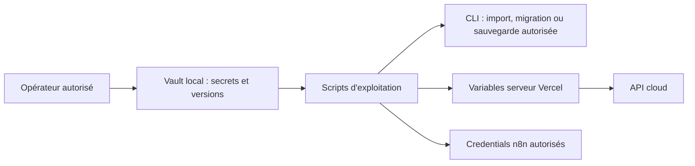

# Gestion des secrets avec Vault

Référence documentaire au 21 septembre 2026. Ce guide décrit les responsabilités et l'outillage ; il n'atteste pas l'état courant du coffre ni une rotation récente. Aucune valeur secrète n'est incluse.

## Rôle du coffre

Vault est exploité localement avec stockage persistant et configuration TLS dans `infra/vault/`. Les scripts opérateur récupèrent les secrets nécessaires aux tâches autorisées. Les applications publiées utilisent leurs variables serveur Vercel et les credentials n8n : elles ne consultent pas ce coffre local à chaque requête.

## Périmètres

| Périmètre | Contenu / rôle |
| --- | --- |
| Backend local | Connexions de développement, sessions, chiffrement et accès aux services |
| Infrastructure locale | Secrets nécessaires aux conteneurs de développement |
| Production | Connexions Supabase / Atlas, services externes et variables serveur |
| Opérateur | Accès nécessaires aux migrations et opérations explicitement autorisées |
| Récupération | Moyens privés de restauration du coffre, exclus de Git |

Consulter [l'inventaire des variables](quality/CONFIGURATION.md) pour les noms et leurs usages. Le rôle applicatif ne remplace pas les accès privilégiés de migration. Les variables `VITE_*` sont publiques et ne doivent contenir aucune de ces valeurs.

## Bonnes pratiques d'exploitation du projet

- Utiliser le rôle correspondant à l'opération ; ne pas utiliser un accès root pour l'exploitation courante.
- Conserver les identifiants et moyens de récupération dans les emplacements privés, hors dépôt et hors dossier de rendu.
- Lors d'une rotation documentaire, conserver les versions nécessaires au déchiffrement des anciens fichiers.
- Répliquer uniquement les variables serveur nécessaires, puis redéployer les composants concernés et vérifier leur comportement.
- Sauvegarder le coffre et ses moyens de récupération selon la procédure autorisée. Une sauvegarde Git n'inclut ni le coffre ni les bases ni les credentials cloud.

## Preuves et limites

L'installation, les essais isolés, une rotation effective et une restauration indépendante sont des validations différentes. La présence d'un script n'atteste pas son exécution. Le dossier de rendu doit conserver la date et la portée des preuves sans afficher de clé, d'invitation ou de QR MFA.

[Configuration](quality/CONFIGURATION.md) · [Sauvegardes](quality/SAUVEGARDES_OPERATIONNELLES_2026-09-19.md) · [Reprise](quality/EXPLOITATION_REPRISE.md) · [Architecture](SCHEMA_ARCHITECTURE_V1.md).
