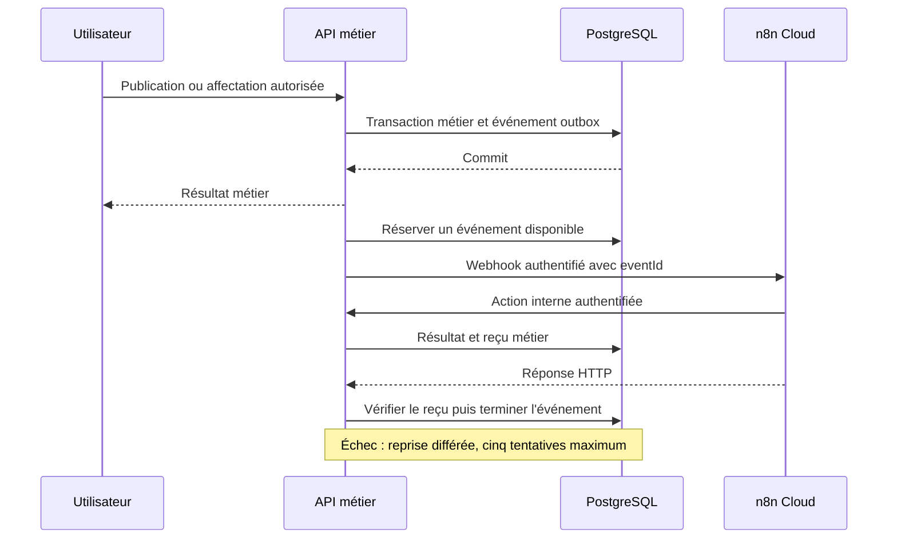
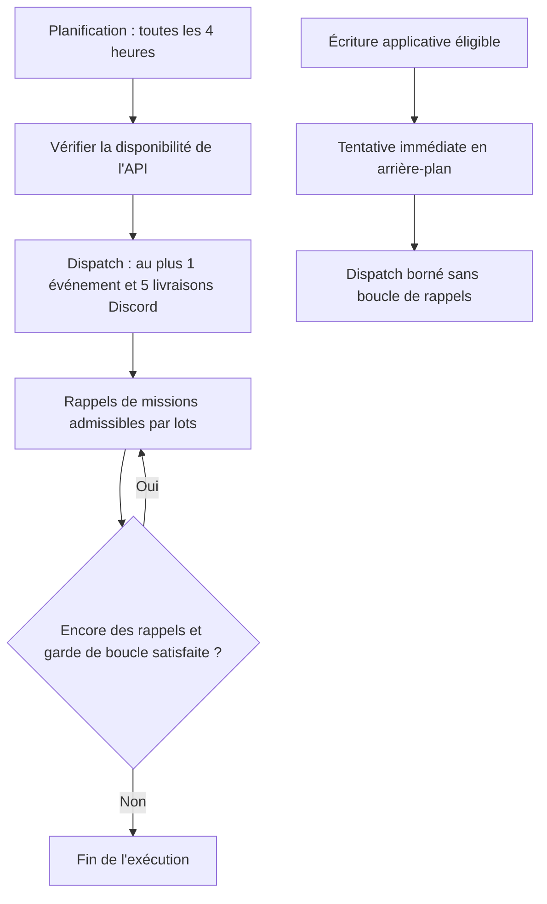

# Automatisations n8n — fonctionnement et preuves

État documentaire au **21 septembre 2026**. Les exports décrivent une configuration ; ils ne prouvent ni son activation actuelle ni une livraison réussie. La publication de la reprise à quatre heures a été constatée dans n8n le 21 septembre. Aucun nouvel appel fournisseur ou workflow n'a été lancé pour cette mise à jour documentaire.

## Répartition des responsabilités

n8n orchestre les appels HTTP. Le backend contrôle les droits et l'éligibilité, calcule le matching, produit les PDF et enregistre les notifications. Discord est un canal facultatif ; il ne constitue pas à lui seul un workflow nocode distinct.

La réservation dure 90 secondes. Le délai minimal de reprise augmente après chaque échec ; ce n'est pas une garantie d'exécution à la seconde près. Sans reçu métier final, un HTTP 200 ne suffit pas. Après épuisement, une reprise opérateur auditée est nécessaire.

## Catalogue des exports de production

| Workflow | Déclencheur | Travail réalisé | Export |
| --- | --- | --- | --- |
| Matching | `MissionOPEN` / `MatchRequested` via webhook | Recontrôler éligibilité et préférences, enregistrer notifications sans doublon | [matches](n8n/InfiMatch-production-matches.json) |
| Confirmation | `AssignmentCreated` via webhook | Générer la confirmation PDF et son reçu métier | [confirmation](n8n/InfiMatch-production-confirmation.json) |
| Annulation | `MissionCANCELLED` via webhook | Traiter les suites de l'annulation et son reçu | [cancellation](n8n/InfiMatch-production-cancellation.json) |
| Rappels | Webhook protégé | Appliquer les conditions et plafonds des relances | [reminders](n8n/InfiMatch-production-reminders.json) |
| Reprise et rappels | Toutes les 4 heures, Europe/Paris | Santé API, dispatch borné, rappels par lots | [reprise](n8n/InfiMatch-production-reprise-et-rappels.json) |
| Import France Travail | 07 h et 15 h, Europe/Paris dans l'export | Import borné, pagination et reprise contrôlée | [France Travail](n8n/InfiMatch-production-import-France-Travail.json) |
| Import JobsPipe | 07 h, Europe/Paris dans l'export | Import borné et reprise contrôlée | [JobsPipe](n8n/InfiMatch-production-import-JobsPipe.json) |
| Maintenance technique | Expression cron 04 h 15 dans l'export ; vérifier le fuseau de l'instance | Réconciliation, clôtures et nettoyage technique | [maintenance](n8n/maintenance-quotidienne.json) |

Les modèles dans `workflows/` servent aussi aux essais locaux ; ne pas les confondre avec les exports cloud dans `docs/n8n/`. Une importation exige de réassocier les credentials privés puis de publier le workflow.

## Reprises, quotas et relances

La tentative immédiate appelle le dispatch, pas toute la chaîne périodique de rappels. Le rythme de quatre heures représente six déclenchements planifiés par jour pour ce workflow uniquement. Les autres workflows, événements et essais consomment également le quota ; ce chiffre n'est donc pas la consommation totale.

Les imports ne font pas partie de cette boucle. Les rappels contrôlent notamment une mission ouverte et à venir, l'ancienneté minimale, l'intervalle entre rappels et un maximum de trois rappels par mission. Le débit réduit préserve le quota mais peut allonger l'attente d'une file chargée.

## Évolution préparée le 24 septembre

Le [nouvel export](n8n/2026-09-24/README.md) conserve la cadence de quatre heures et ajoute les rappels avant mission puis la distribution après leur création. Il est inactif dans le dépôt ; ne pas l’assimiler au workflow réellement publié. Le rappel H-2 n’est pas garanti. Le socle planifié observé consomme environ 10 exécutions/jour : 6 contrôles, 2 imports France Travail, 1 JobsPipe et 1 maintenance, hors événements, relais et reprises.

## Deux preuves à remettre au jury

Privilégier deux workflows métier distincts : **matching** et **confirmation PDF**. Pour chacun, conserver :

1. L'export JSON sans secrets et la version du code concernée.
2. La date et l'identifiant d'une exécution réelle, avec les étapes réussies visibles.
3. Le résultat associé au même événement : notification interne ou PDF accessible au participant autorisé.
4. Le contexte fictif du scénario et les limites constatées. Si Discord ou email est revendiqué, ajouter une réception effective ; l'enregistrement en base ne la prouve pas.

Le [rapport du 18 septembre](AUTOMATIONS_VALIDATION_2026-09-18.md) reste une preuve de sa campagne. Il ne valide pas automatiquement la version actuelle. Réutiliser les preuves pertinentes avant de lancer des essais supplémentaires ; ne jamais recopier tokens, données personnelles ou clés dans les captures du rendu.

Sources : [service métier](../backend/src/automation/automation.module.ts), [jobs cloud](../backend/src/automation/cloud-jobs.module.ts), [relances](../backend/src/automation/reminders.ts), [continuité et changement de rythme](quality/N8N_CONTINUITE_2026-09-19.md). [Recette finale](rendu/RECETTE_FINALE.csv).
