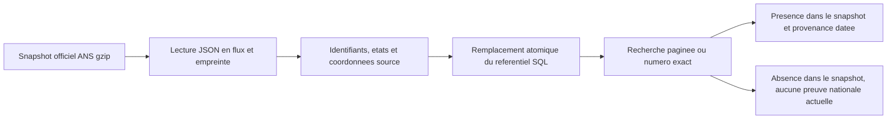

# Flux métier et techniques V1

Ces schémas décrivent le backend présent. Les scénarios testés et les limites sont dans les [exigences](REQUIREMENTS_V1.md) et la [reprise — archive](https://github.com/lebretyves/Infimactch_Prod/blob/fd68a377da28a76151483529ac62473eed99d264/docs/REPRISE_BACKEND_V1.md). Les appels utilisateurs portent le préfixe `/api/v1`.

## Authentification et écritures

```mermaid
sequenceDiagram
    participant Client
    participant API
    participant PostgreSQL
    Client->>API: GET auth/csrf
    API->>PostgreSQL: Session anonyme
    API-->>Client: Cookie et csrfToken
    Client->>API: POST auth/login avec cookie, Origin, X-CSRF-Token
    API->>PostgreSQL: Lire compte et vérifier session
    API->>API: Vérifier Argon2id et renouveler session
    API->>PostgreSQL: Persister nouvelle session
    API-->>Client: Nouveau cookie et nouveau csrfToken
    Client->>API: Écriture avec les nouveaux éléments
    API->>API: Valider DTO et droits
    API->>PostgreSQL: Mutation autorisée
    API-->>Client: Résultat
```

Un échec d'authentification ou de protection d'écriture interrompt ce parcours. La déconnexion détruit la session serveur. Les routes d'automatisation emploient une authentification de service distincte.

## RPPS : aucun contrôle manuel par l'agence

```mermaid
flowchart TD
    input["Saisie ou modification du RPPS"] --> pending["PENDING et incrément de version"]
    pending --> request["Recherche exacte ANS"]
    request --> current{"Numéro et version encore courants ?"}
    current -->|"Non"| ignored["Ignorer le retour tardif"]
    current -->|"Oui"| result{"Réponse exploitable ?"}
    result -->|"Identifiant exact retrouvé"| found["FOUND"]
    result -->|"Recherche exacte vide"| missing["NOT_FOUND"]
    result -->|"Panne, clé absente ou réponse incohérente"| waiting["PENDING"]
    found --> rules["Vérifier aussi les autres critères métier"]
    missing --> blocked["Candidature interne et nouvelle affectation bloquées"]
    waiting --> hold["Actions en attente jusqu'à vérification réussie"]
```

`NOT_CHECKED` ne satisfait pas non plus le contrôle. Le profil et la recherche restent accessibles. Un changement RPPS ne rétro-annule pas une affectation. Les réponses fournisseurs des tests sont simulées ; l'accès ANS réel reste à valider.

## Recherche et matching

Le score par défaut est `100 × (0,45 C + 0,25 Z + 0,20 D + 0,10 E)`. Les pondérations configurées changent la version des règles. La distance est calculée avec PostGIS. Les disponibilités doivent couvrir tout l'intervalle, après retrait des indisponibilités, avec des bornes semi-ouvertes.

Les champs externes inconnus excluent une offre des filtres stricts correspondants. Une offre externe ne devient pas une mission interne et ne reçoit pas le score complet interne. Les explications expirées, liées à un profil ou à une mission modifiés sont signalées comme périmées.

## Candidature et affectation humaine

```mermaid
sequenceDiagram
    participant Infirmier
    participant Agence
    participant API
    participant PostgreSQL
    Infirmier->>API: Candidature avec consentement à la version
    API->>PostgreSQL: Contrôles et candidature SUBMITTED
    Agence->>API: Sélection ou refus selon ses droits
    Agence->>API: Affectation avec applicationId et Idempotency-Key
    API->>PostgreSQL: Transaction et verrous mission, profil, candidature
    API->>API: Recontrôler droits, consentement et éligibilité
    API->>PostgreSQL: Assignment ACTIVE, application ACCEPTED, mission FILLED
    API->>PostgreSQL: Audit et outbox AssignmentCreated
    PostgreSQL-->>API: Commit
    API-->>Agence: Affectation validée
```

Le même identifiant d'idempotence avec le même contenu renvoie le résultat initial ; un contenu différent produit un conflit. Un conflit de disponibilité empêche le commit. Une modification substantielle ou une réouverture exige un consentement à jour. La sélection seule ne constitue pas une affectation.

## États des missions

```mermaid
stateDiagram-v2
    [*] --> DRAFT
    DRAFT --> OPEN: publication
    OPEN --> FILLED: affectation validée
    FILLED --> COMPLETED: clôture autorisée
    DRAFT --> CANCELLED: annulation
    OPEN --> CANCELLED: annulation
    FILLED --> CANCELLED: annulation
    CANCELLED --> DRAFT: réouverture avec nouvelle version
```

Une mission terminée ne peut pas être rouverte. L'annulation met à jour mission, affectation et statut de confirmation dans une transaction ; le document historique reste identifiable comme annulé.

## Trois workflows n8n

```mermaid
sequenceDiagram
    participant Worker
    participant PostgreSQL
    participant n8n
    participant API
    Worker->>PostgreSQL: Réserver un événement après commit
    PostgreSQL-->>Worker: Événement et réservation temporaire
    Worker->>n8n: Webhook authentifié de matching ou confirmation
    n8n->>API: Route interne authentifiée
    API->>PostgreSQL: Recontrôles, résultat métier et reçu final
    n8n-->>Worker: Retour HTTP
    Worker->>PostgreSQL: Vérifier le reçu métier final
    Worker->>PostgreSQL: Marquer le traitement ou programmer une reprise
```

- A — `matches.json` : mission publiée ou demande de recalcul → éligibilité et préférences actuelles → notification interne sans doublon.
- B — `reminders.json` : déclenchement horaire n8n → contrôle d'une mission ouverte, à venir et suffisamment ancienne → relance unique par fenêtre. Un webhook authentifié permet aussi la recette.
- C — `confirmation.json` : événement `AssignmentCreated` → génération backend du PDF fictif non signé → accès privé et notifications.

Le worker réserve pendant 90 secondes et reprend avec temporisation exponentielle, au maximum cinq tentatives. Un HTTP 200 sans reçu final ne suffit pas. Une panne d'automatisation n'annule pas l'affectation déjà validée.

## Confirmation et documents privés

```mermaid
flowchart TD
    event["AssignmentCreated après commit"] --> lease["Réserver la génération avec jeton et expiration"]
    lease --> pdf["Créer un PDF fictif non signé"]
    pdf --> stage["Métadonnées STAGING et chiffrement AES-256-GCM"]
    stage --> privateFile["Écrire le fichier privé"]
    privateFile --> check["Revérifier affectation et version"]
    check -->|"Toujours valable"| ready["Confirmation READY et reçu final"]
    check -->|"Annulée"| cancelled["Confirmation CANCELLED"]
    ready --> auth["Téléchargement : droits actuels du participant"]
    auth --> decrypt["Vérifier le tag et déchiffrer"]
    decrypt --> download["Réponse privée en pièce jointe"]
    stage -.->|"Interruption"| recover["CLI reconcile-documents"]
    recover --> valid{"Fichier, clé, tag et taille valides ?"}
    valid -->|"Oui"| docReady["Document READY"]
    valid -->|"Non"| keep["Document maintenu en attente"]
```

La réconciliation documentaire ne remplace pas la reprise métier de la confirmation. Les anciennes clés restent nécessaires aux anciens documents. Aucun document, clé ou fichier `.env` n'entre dans le bundle Git. Ce PDF n'est pas un contrat signé ; contrats F24 en V3, attestation en V2 et références hors V1.

## Referentiel FINESS

Les donnees d'identite sans coordonnees restent consultables. Ce flux ne modifie ni les droits des organisations ni les lieux des missions. Voir [l'acquisition reelle](ACQUISITION_REELLE.md).

## Corrections de la recette du 15 septembre 2026

Les commandes mission, candidature et creation de besoin suivent : droits actuels -> controle Idempotency-Key/contenu -> lecture du recu ou mutation -> recu dans la meme transaction. Le classement ne contient plus de dossiers ineligibles. Une confirmation reste READY apres cloture normale ; annulation et cloture restent distinctes.

Apres cinq echecs de distribution : EXHAUSTED -> commande operateur retry-outbox -> evenement remis en attente, sauf reservation active. La reprise est auditee. Voir le [bilan](RECETTE_BACKEND_V1.md).
