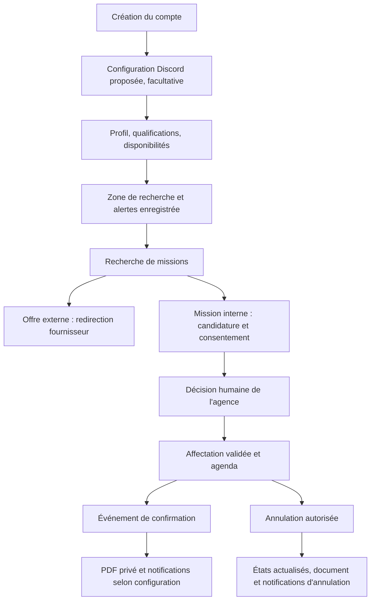
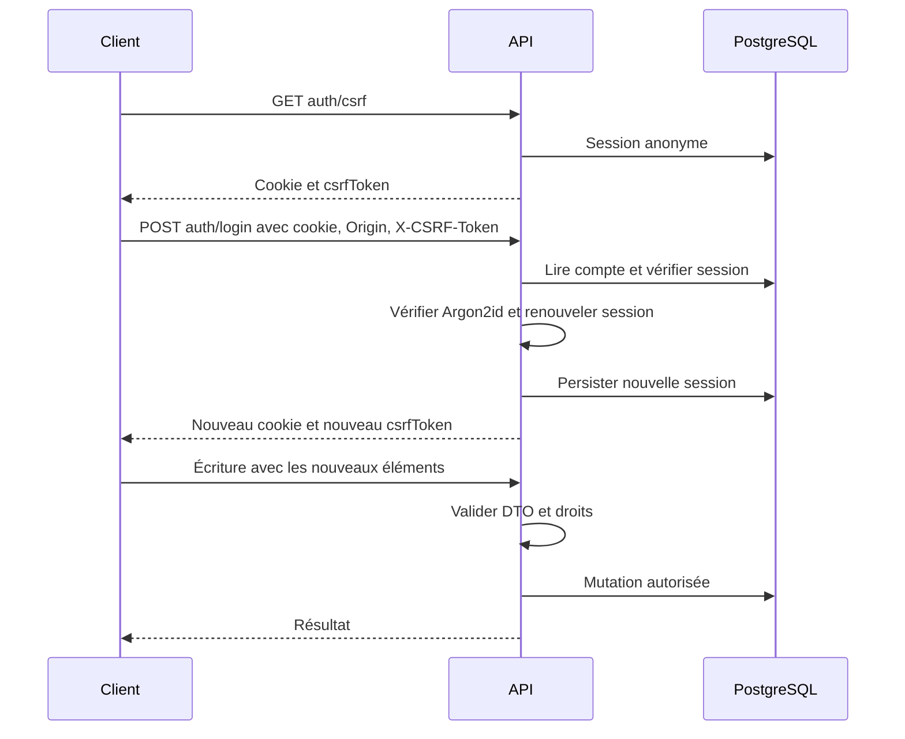
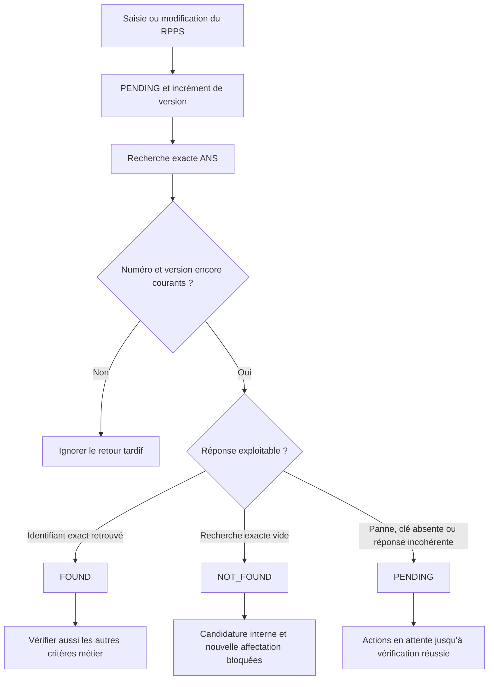
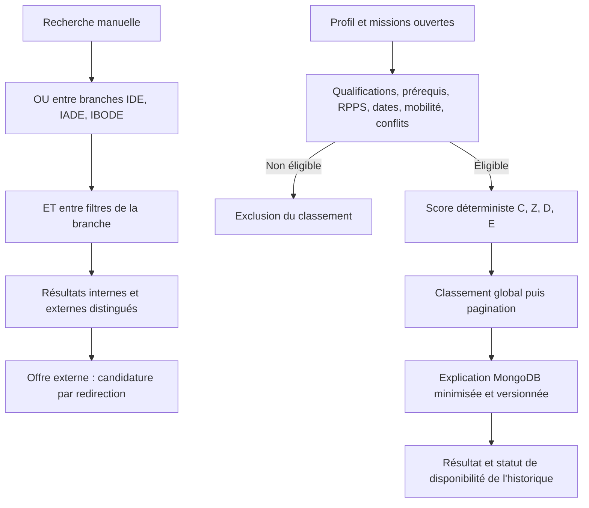
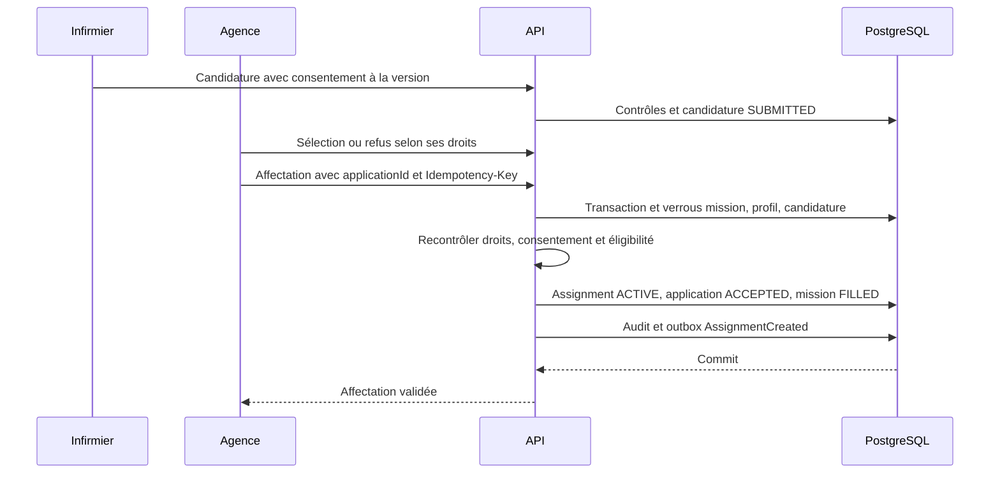
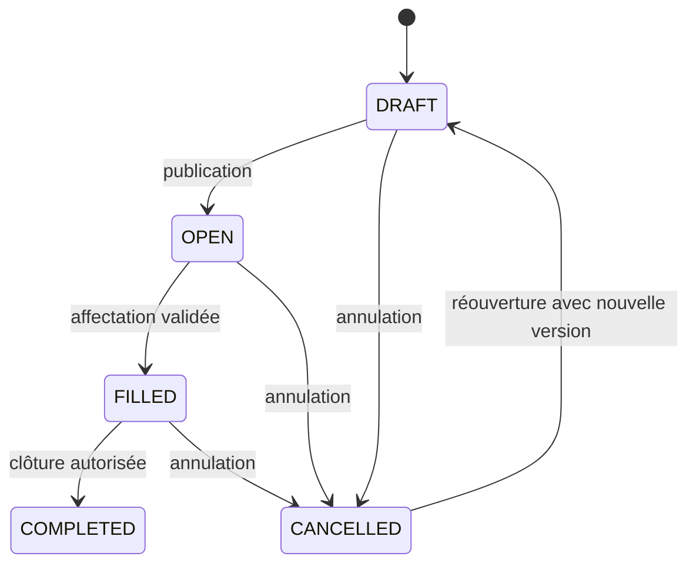
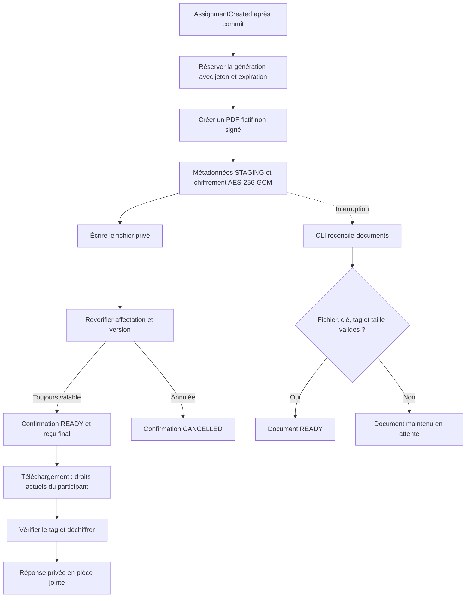
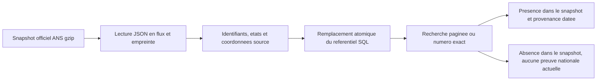

# Flux métier et techniques — 21 septembre 2026

Ces schémas décrivent les mécanismes implémentés, pas une nouvelle recette publiée. Voir les [exigences](REQUIREMENTS_V1.md), les [automatisations](AUTOMATISATIONS.md) et les [réserves du rendu](rendu/README.md). Les appels utilisateurs portent le préfixe `/api/v1`.

## Parcours utilisateur complet

Le domicile reste distinct de la zone de recherche et d'alertes. Une recherche ponctuelle ne modifie pas les préférences enregistrées. Le RIB est facultatif. Les parcours PDF et notification sont asynchrones : la réussite de l'affectation n'atteste pas leur achèvement.

## Authentification et écritures

Un échec d'authentification ou de protection d'écriture interrompt ce parcours. La déconnexion détruit la session serveur. Les routes d'automatisation emploient une authentification de service distincte.

## RPPS : aucun contrôle manuel par l'agence

`NOT_CHECKED` ne satisfait pas non plus le contrôle. Le profil et la recherche restent accessibles. Un changement RPPS ne rétro-annule pas une affectation. Les réponses fournisseurs des tests sont simulées ; l'accès ANS réel reste à valider.

## Recherche et matching

Le score par défaut est `100 × (0,45 C + 0,25 Z + 0,20 D + 0,10 E)`. Les pondérations configurées changent la version des règles. La distance est calculée avec PostGIS. Les disponibilités doivent couvrir tout l'intervalle, après retrait des indisponibilités, avec des bornes semi-ouvertes.

Les champs externes inconnus excluent une offre des filtres stricts correspondants. Une offre externe ne devient pas une mission interne et ne reçoit pas le score complet interne. Les explications expirées, liées à un profil ou à une mission modifiés sont signalées comme périmées.

## Candidature et affectation humaine

Le même identifiant d'idempotence avec le même contenu renvoie le résultat initial ; un contenu différent produit un conflit. Un conflit de disponibilité empêche le commit. Une modification substantielle ou une réouverture exige un consentement à jour. La sélection seule ne constitue pas une affectation.

## États des missions

Une mission terminée ne peut pas être rouverte. L'annulation met à jour mission, affectation et statut de confirmation dans une transaction ; le document historique reste identifiable comme annulé.

## Automatisations et reprise

Les workflows de matching, confirmation et annulation sont déclenchés par événements. Les rappels et imports disposent de parcours séparés. La reprise cloud est publiée toutes les **quatre heures**, avec une tentative immédiate après les écritures applicatives éligibles.

Voir le [catalogue et les schémas d'automatisation](AUTOMATISATIONS.md) pour les déclencheurs, les limites de débit, les reprises et les preuves attendues.

## Confirmation et documents privés

La réconciliation documentaire ne remplace pas la reprise métier de la confirmation. Les anciennes clés restent nécessaires aux anciens documents. Aucun document, clé ou fichier `.env` n'entre dans le bundle Git. Ce PDF est une confirmation applicative, pas un contrat de travail signé. Les agences restent responsables de l'emploi et de la rémunération.

## Referentiel FINESS

Les donnees d'identite sans coordonnees restent consultables. Ce flux ne modifie ni les droits des organisations ni les lieux des missions. Voir [l'acquisition reelle](ACQUISITION_REELLE.md).

## Corrections de la recette du 15 septembre 2026

Les commandes mission, candidature et creation de besoin suivent : droits actuels -> controle Idempotency-Key/contenu -> lecture du recu ou mutation -> recu dans la meme transaction. Le classement ne contient plus de dossiers ineligibles. Une confirmation reste READY apres cloture normale ; annulation et cloture restent distinctes.

Apres cinq echecs de distribution : EXHAUSTED -> commande operateur retry-outbox -> evenement remis en attente, sauf reservation active. La reprise est auditee. Voir les [exigences](REQUIREMENTS_V1.md) et les [automatisations](AUTOMATISATIONS.md).
