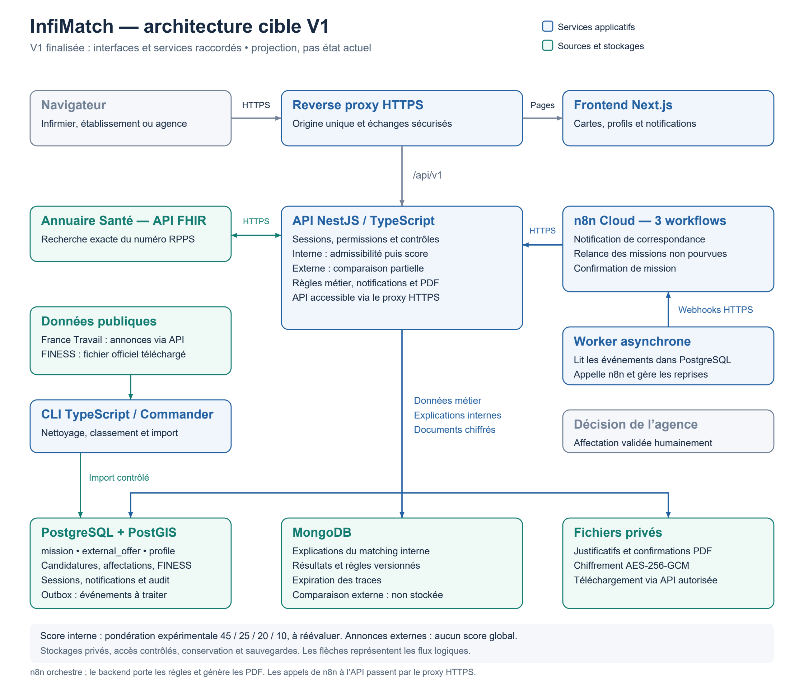

# InfiMatch — architecture cible de la V1 finalisée

[PNG](diagrams/architecture-infimatch-v1-cible.png) · [PDF](diagrams/architecture-infimatch-v1-cible.pdf) · [SVG](diagrams/architecture-infimatch-v1-cible.svg)

Cette vue représente la cible demandée, lorsque les interfaces et services sont raccordés. Elle ne remplace pas [le schéma de l'état actuel](SCHEMA_ARCHITECTURE_V1.md) et n'atteste pas d'un déploiement effectué.

La cible reprend Next.js et un reverse proxy HTTPS, ainsi que le raccordement de l'instance n8n Cloud fournie par l'utilisateur. Les trois workflows orchestrent les actions du backend ; la génération PDF et les décisions métier restent dans NestJS. Les flèches sont logiques : les appels Cloud vers l'API passent par le proxy HTTPS.
Le worker lit l'outbox PostgreSQL et gère les reprises. Les stockages restent privés.
Le frontend affiche les notifications, les missions internes et les annonces externes. L'affectation est une décision humaine de l'agence.

Le score interne utilise une pondération expérimentale à réévaluer. Les annonces externes conservent une comparaison partielle sans score global : terminer la V1 ne rend pas complètes les données manquantes du fournisseur.
Le dessin ne vaut pas certification réglementaire. Les contrôles légaux, notamment l'expérience en équivalent temps plein, restent à traiter selon le périmètre validé avant un usage opérationnel ; leur état actuel est décrit dans le bilan backend.

Source reproductible : scripts/draw-target-architecture.py, basée sur scripts/draw-architecture.py. Même environnement documentaire Python que la vue actuelle.
