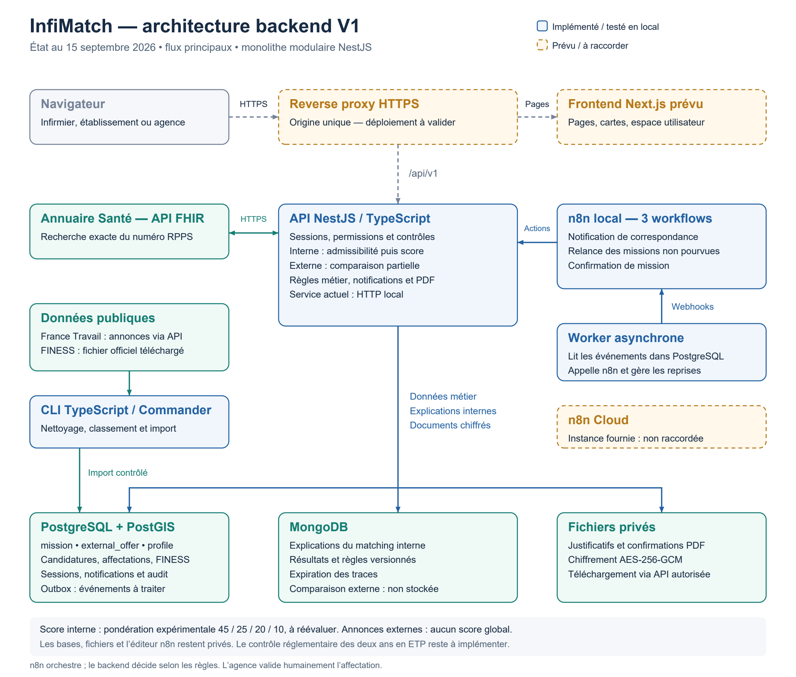

# Architecture InfiMatch V1 — état au 15 septembre 2026

[PNG](diagrams/architecture-infimatch-v1.png) · [PDF vectoriel](diagrams/architecture-infimatch-v1.pdf) · [SVG modifiable](diagrams/architecture-infimatch-v1.svg)

Les pointillés orange du visuel désignent les éléments prévus ou non raccordés : frontend Next.js, reverse proxy HTTPS et n8n Cloud. Le backend est actuellement exécuté en HTTP local. La présence du proxy dans le schéma ne constitue pas une validation du chiffrement en transit.

## Backend et stockages
Le monolithe modulaire NestJS partage ses règles entre l'API, le worker et la CLI. Ce sont des processus distincts, sans découpage en microservices.
- PostgreSQL / PostGIS : comptes, profils, missions internes (`mission`), annonces externes (`external_offer`), candidatures, affectations, FINESS, notifications, sessions, audits et événements outbox.
- MongoDB : explications minimisées et versionnées du matching interne, avec expiration. La comparaison partielle externe est calculée à la lecture et n'y est pas stockée.
- Fichiers privés : documents fictifs et confirmations PDF, chiffrés en AES-256-GCM, accessibles via l'API après contrôle des droits.

Les flèches principales du visuel décrivent les flux logiques ; elles ne représentent pas chaque lecture SQL ni chaque réponse réseau. Le worker lit explicitement les événements PostgreSQL, appelle n8n puis contrôle le reçu final en base.

## Sources réelles
L'API Annuaire Santé FHIR est appelée pour le RPPS. Elle ne passe pas par l'import des annonces.
France Travail fournit les annonces JSON, acquises et normalisées par la CLI. FINESS provient d'un fichier officiel téléchargé puis importé dans le référentiel local.
Les accès réels France Travail, FINESS et RPPS ont été testés. FINESS ne prouve ni un besoin de recrutement ni un partenariat.

## Automatisations
Trois workflows n8n sont testés en local : notification de correspondance, relance de mission non pourvue et confirmation de mission. Le worker déclenche les workflows sur événements ; la relance possède également un déclencheur horaire.
n8n orchestre les appels ; les règles métier, les notifications en base et la génération PDF restent dans le backend.
Les notifications sont internes à InfiMatch. L'instance n8n Cloud fournie n'est pas raccordée.

## Deux modes de comparaison
Pour les missions internes : contrôles d'admissibilité, puis score expliqué. Les pondérations 45 / 25 / 20 / 10 sont expérimentales et à réévaluer.
Pour les annonces externes : comparaison partielle au profil connecté, sans score global ni disponibilité présumée. L'option explicite de recherche peut inclure des pistes incomplètes en signalant les filtres non vérifiés.
L'agence valide humainement l'affectation. Le contrôle complet des deux années réglementaires en équivalent temps plein n'est pas implémenté ; le plafond d'expérience du score n'en constitue pas une validation.

## Sources modifiables et reproduction
[Source Mermaid](architecture-v1.mmd) : vue logique complémentaire. Ses pointillés identifient les appels externes ou les intégrations prévues selon leur libellé ; la légende orange s'applique au visuel PNG/PDF/SVG.
[Script de dessin](../scripts/draw-architecture.py) : génère les trois exports. Outil documentaire facultatif sous Windows, avec Python, reportlab, Pillow, pypdfium2 et les polices Arial Windows. Le backend Node n'en dépend pas.
Exécution : `python scripts/draw-architecture.py`.
Schéma relu visuellement après export. Aucun changement de comportement du backend dans cette mise à jour.

Voir [les exigences](REQUIREMENTS_V1.md), [les flux](FLUX_V1.md), [la comparaison partielle](OFFRES_EXTERNES_V1.md) et [les preuves](proofs/verification.json).

Vue distincte : [architecture cible lorsque la V1 sera finalisee](SCHEMA_ARCHITECTURE_CIBLE_V1.md).
