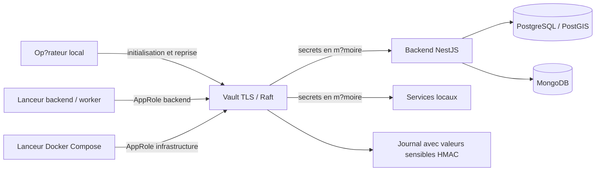

# Vault ? InfiMatch V1

## ?tat livr? le 15 septembre 2026

HashiCorp Vault 2.1.0 est install? en Docker local, en mode serveur persistant Raft (un n?ud), avec TLS et audit. Image officielle fig?e par digest dans `infra/vault/compose.yaml`. Interface : https://127.0.0.1:58200/ui/ ; seul le port loopback est publi?.

Les valeurs existantes du `.env` ont ?t? copi?es dans KV v2 sans changer les mots de passe des bases, les cl?s de chiffrement ni les acc?s fournisseurs. Les commandes Vault utilisent ces valeurs, inject?es en m?moire dans le processus enfant. Le `.env` historique reste pr?sent pour les commandes historiques ; il n?est pas charg? par le backend en mode Vault. Les processus d?j? d?marr?s avant cette installation ne sont pas bascul?s silencieusement.

## Architecture et acc?s



| Acc?s | Droit | Dur?e |
|---|---|---|
| backend | Lecture de `kv/data/infimatch/v1/backend` uniquement, plus r?vocation de son propre jeton | SecretID 7 jours ; jeton 5 minutes, max 10 minutes |
| infra | Lecture de `kv/data/infimatch/v1/infra` uniquement, plus r?vocation de son propre jeton | SecretID 7 jours ; jeton 5 minutes, max 10 minutes |
| operator | Gestion des secrets V1, ?mission/r?vocation des SecretID V1, lecture des snapshots | SecretID 30 jours ; jeton 5 minutes, max 10 minutes |

Aucun acc?s V2 accord?. Les jetons du lanceur sont r?voqu?s apr?s lecture, avant lancement de l?application. Les secrets statiques d?j? charg?s restent en m?moire du processus ; une modification dans Vault n?cessite un red?marrage contr?l?. Il ne s?agit pas d?une injection continue par Vault Agent ni de mots de passe de bases dynamiques.

Le jeton root initial a ?t? r?voqu? et retir? du fichier de r?cup?ration. Les politiques backend/infra ne permettent ni ?criture de secrets ni gestion des politiques.

## Utilisation

Depuis `E:/Interimatch/InfiMatch` :

```powershell
npm run vault:status
npm run start:vault
```

Dans un second terminal :

```powershell
npm run worker:vault
```

Autres commandes :

```powershell
npm run vault:check
npm run cli:vault -- --help
npm run vault:infra
npm run vault:snapshot
```

`vault:infra` ex?cute Compose avec les secrets infrastructure de Vault et un fichier de configuration sans secret (`.env.vault.example`). Ne pas ex?cuter `docker compose config` en affichant les valeurs r?solues. Cette commande peut recr?er des services si leur configuration a chang? ; elle n?a pas ?t? ex?cut?e sur les services existants pendant cette recette.

## Installation et TLS

Pr?requis : Node 24, Docker, OpenSSL (fourni par Git pour Windows sur ce poste) et le `.env` existant pour le premier import.

```powershell
npm run vault:setup
```

Le script g?n?re un certificat local, cr?e le volume, initialise et d?verrouille Vault, active l?audit et KV v2, puis cr?e les AppRoles. Une ex?cution ult?rieure conserve les secrets d?j? install?s. Les ?crasements KV utilisent le contr?le de version CAS ; cinq versions sont conserv?es.

Sur Windows, si le navigateur ou l?inspection HTTPS ne reconna?t pas l?autorit? locale :

```powershell
npm run vault:trust
npm run vault:setup
```

Sur ce poste, Norton r??mettait un certificat non fiable. L?autorit? locale InfiMatch a ?t? ajout?e au magasin `CurrentUser/Root`. Le client v?rifie TLS avec l?autorit? locale et les autorit?s syst?me reconnues ; aucune d?sactivation de TLS ou de l?antivirus. Le certificat local expire apr?s un an ; son renouvellement et celui de sa confiance doivent ?tre planifi?s.

## Reprise apr?s red?marrage

Vault red?marre verrouill? : c?est le comportement attendu avec le scellement Shamir.

```powershell
docker compose -f infra/vault/compose.yaml up -d
npm run vault:unseal
npm run vault:check
```

Le lanceur refuse de d?marrer si Vault est verrouill? ou inaccessible ; il ne r?cup?re pas silencieusement les secrets du `.env`. Une application d?j? lanc?e conserve ses secrets en m?moire : sceller Vault n?arr?te pas cette application.

## Fichiers priv?s et r?cup?ration

`data/vault/` est ignor? par Git et limit? au compte Windows courant et ? SYSTEM. Il contient certificats/cl? priv?e, identifiants AppRole, configuration d?ex?cution, snapshots et `recovery.json`.

Le scellement est configur? avec trois parts et un seuil de deux. Les trois parts sont regroup?es dans le fichier priv? pour cette installation locale : cela ne constitue pas une s?paration entre trois d?tenteurs. Pour un environnement partag?, r?partir les parts entre responsables distincts et conserver une copie s?curis?e hors de ce poste.

Un snapshot Raft est chiffr? par Vault, mais il reste sensible. Sauvegarder s?par?ment les parts de r?cup?ration et les cl?s TLS n?cessaires. Ne pas inclure ces fichiers dans les archives de conversation. Une restauration compl?te dans une instance distincte reste ? exercer ; le test livr? prouve un red?marrage avec persistance, pas une restauration apr?s perte du volume.

## Maintenance ? planifier

- `npm run vault:rotate` : remplace les SecretID AppRole et r?voque les pr?c?dents ; ne change ni les mots de passe PostgreSQL/MongoDB ni les cl?s documentaires. Commande pr?par?e, mais rotation r?elle non ex?cut?e : le contr?le automatique a refus? cette action faute d?autorisation explicite distincte.
- `npm run vault:sync` : copie explicitement les valeurs actuelles du `.env` dans les versions KV ; ne pas l?utiliser comme rotation de mot de passe serveur.
- Si les identifiants op?rateur ont expir?, la reprise exige une proc?dure administrative utilisant les parts Shamir ; le jeton root initial ne peut pas ?tre r?utilis?.
- La suppression du `.env` historique, les comptes SQL/Mongo au moindre privil?ge, TLS entre bases et backend, haute disponibilit?, auto-unseal et restauration compl?te restent des travaux distincts.

L?interface Vault utilise ses propres m?thodes d?authentification. Le compte PostgreSQL `infimatch` n?est pas un compte Vault ; aucun jeton root permanent n?est fourni pour l?interface.

## V?rifications et port?e

- 10 tests Vault passants : validation TLS, refus des identifiants erron?s, s?paration backend/infra/V2, interdiction d??criture, r?vocation du jeton temporaire et absence de repli `.env`.
- 55 tests unitaires backend passants ; typage et compilation passants.
- Red?marrage du coffre : verrouillage attendu, refus du lanceur puis persistance identique apr?s d?verrouillage.
- API d?marr?e avec Vault sur un port local de recette : endpoint de sant? HTTP 200, puis processus de recette arr?t?.
- Connexion PostgreSQL issue de Vault v?rifi?e ; snapshot Raft cr?? dans le dossier priv?.
- Tests fonctionnels historiques complets, connexion n8n Cloud, restauration int?grale et rotation AppRole r?elle non relanc?s dans cette installation.

Preuve : `docs/proofs/vault-lifecycle.json`. Les 71 tests et la couverture historique de la V1 ne deviennent pas une nouvelle mesure par l?ajout des tests Vault.

## Sources officielles

- https://developer.hashicorp.com/vault/api-docs/auth/approle
- https://developer.hashicorp.com/vault/docs/configuration/storage/raft
- https://developer.hashicorp.com/vault/docs/configuration/listener/tcp
- https://hub.docker.com/r/hashicorp/vault


## Correction de l'ouverture de Vault - 15 septembre 2026

Cause observee dans Edge : ERR_SSL_CLIENT_AUTH_CERT_NEEDED. Le listener demandait un certificat client facultatif alors que cette installation utilise AppRole. Ajout de tls_disable_client_certs = true dans infra/vault/server.hcl ; HTTPS, verification du certificat serveur et authentification AppRole conserves. Redemarrage et deverrouillage effectues.

Verification : page Sign in to Vault affichee a https://127.0.0.1:58200/ui/vault/auth ; 10 tests Vault reussis. Aucune connexion utilisateur effectuee, aucun nouveau jeton permanent cree. Aucun secret KV modifie. Le constat anterieur d'interface blanche est resolu.

Reference : https://support.hashicorp.com/hc/en-us/articles/5714330338323-Disable-Prompt-for-Client-Certificate-When-Loading-UI


# Acces personnel Vault - cree le 15 septembre 2026

Apres autorisation explicite de recuperation administrateur, le compte lebre a ete cree avec Userpass. Connexion API et navigateur verifiees. Policy infimatch-personal-lebre : lecture des secrets backend et infra V1, navigation par metadonnees, session personnelle et changement de son propre mot de passe. Aucun droit de modification des secrets, V2 ou administration. Session 30 minutes, maximum 2 heures.

Mot de passe aleatoire remis uniquement dans data/vault/Acces-Vault.txt et userpass-lebre.json, proteges par ACL Windows (utilisateur courant et SYSTEM), ignores par Git. Ces fichiers ne sont pas inclus dans les sauvegardes de conversation. Ne pas copier leur contenu dans les documents. Une modification du mot de passe dans Vault ne met pas automatiquement ces fichiers a jour.

Le jeton root temporaire a ete revoque et son refus d'acces verifie. La configuration de recuperation a ete retablie ; la procedure generate-root sans authentification est de nouveau refusee. Aucun secret KV, mot de passe de base ou SecretID AppRole modifie. Les 10 tests Vault existants passent. Preuve : docs/proofs/vault-personal-account.json.

Connexion : https://127.0.0.1:58200/ui/ ; methode Userpass ; utilisateur lebre. Le compte est un acces utilisateur distinct des 11 secrets applicatifs KV. Les mentions anterieures de compte non cree sont historiques.
