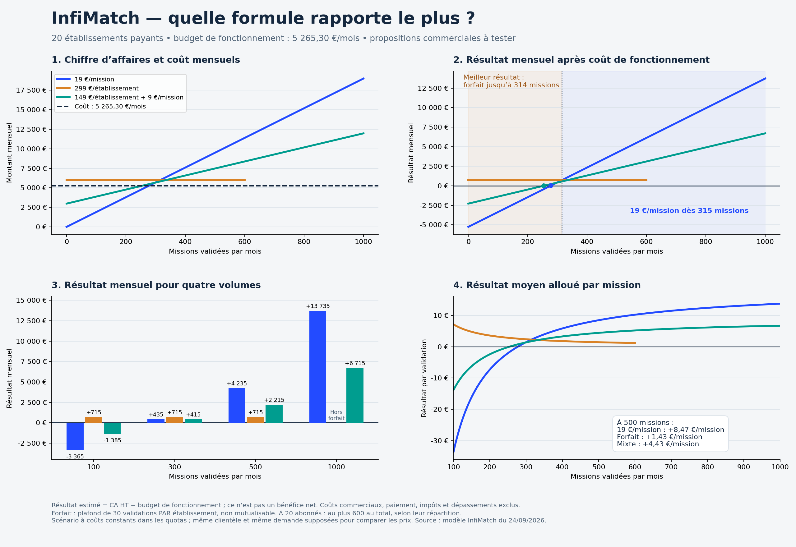
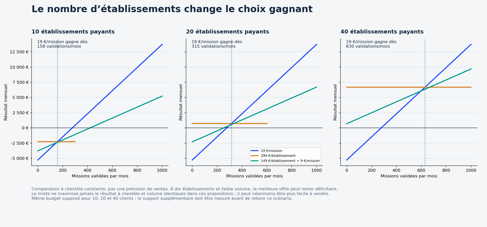

# Comparaison complète : chiffre d’affaires, coûts et résultat

## Conclusion pour InfiMatch

Avec **vingt établissements payants**, la formule **299 EUR/établissement/mois** rapporte le plus pour **0 à 314 validations mensuelles** ; **19 EUR/validation** rapporte le plus à partir de **315 validations**. La formule mixte 149 EUR +9 EUR ne maximise jamais les recettes lorsque le nombre de clients et de missions reste identique entre les trois offres.

Cette conclusion compare le revenu d’InfiMatch, pas l’intérêt financier du client. Elle suppose que les mêmes clients acceptent les trois prix, ce qui reste à tester. À faible usage, le forfait rapporte davantage à InfiMatch parce qu’il coûte davantage au client ; il peut donc être plus difficile à vendre. À fort usage, l’abonnement plafonné peut être plus attractif pour le client. Le mixte peut être un compromis commercial, mais ce modèle ne démontre pas qu’il attire plus de clients.

[PDF complet de six pages](DOSSIER_RENTABILITE_COMPLET.pdf) · [Comparaison de deux pages](comparaison-commerciale.pdf) · [Données détaillées](comparaison-ca-resultat.csv) · [Classeur paramétrable](rentabilite-scenarios.xlsx)

## Tableau à vingt établissements

Coût mensuel : **5 265,30 EUR**, identique entre propositions et volumes dans ce scénario. Chaque cellule affiche **CA HT / résultat après budget**, pas un bénéfice net. Le forfait est limité à trente missions par établissement, soit au plus six cents ici ; au-delà, aucun revenu n’est inventé.

| Missions/mois | 19 EUR/mission : CA / résultat | Forfait 299 : CA / résultat | Mixte : CA / résultat | Meilleur résultat pour InfiMatch |
| ---: | ---: | ---: | ---: | --- |
| 0 | 0,00 / -5 265,30 EUR | 5 980,00 / 714,70 EUR | 2 980,00 / -2 285,30 EUR | Forfait |
| 100 | 1 900,00 / -3 365,30 EUR | 5 980,00 / 714,70 EUR | 3 880,00 / -1 385,30 EUR | Forfait |
| 200 | 3 800,00 / -1 465,30 EUR | 5 980,00 / 714,70 EUR | 4 780,00 / -485,30 EUR | Forfait |
| 250 | 4 750,00 / -515,30 EUR | 5 980,00 / 714,70 EUR | 5 230,00 / -35,30 EUR | Forfait |
| 254 | 4 826,00 / -439,30 EUR | 5 980,00 / 714,70 EUR | 5 266,00 / 0,70 EUR | Forfait |
| 278 | 5 282,00 / 16,70 EUR | 5 980,00 / 714,70 EUR | 5 482,00 / 216,70 EUR | Forfait |
| 300 | 5 700,00 / 434,70 EUR | 5 980,00 / 714,70 EUR | 5 680,00 / 414,70 EUR | Forfait |
| 314 | 5 966,00 / 700,70 EUR | 5 980,00 / 714,70 EUR | 5 806,00 / 540,70 EUR | Forfait |
| 315 | 5 985,00 / 719,70 EUR | 5 980,00 / 714,70 EUR | 5 815,00 / 549,70 EUR | À la mission |
| 500 | 9 500,00 / 4 234,70 EUR | 5 980,00 / 714,70 EUR | 7 480,00 / 2 214,70 EUR | À la mission |
| 600 | 11 400,00 / 6 134,70 EUR | 5 980,00 / 714,70 EUR | 8 380,00 / 3 114,70 EUR | À la mission |
| 750 | 14 250,00 / 8 984,70 EUR | Hors plafond | 9 730,00 / 4 464,70 EUR | À la mission |
| 1000 | 19 000,00 / 13 734,70 EUR | Hors plafond | 11 980,00 / 6 714,70 EUR | À la mission |

## Seuils de couverture et rentabilité

- À la mission : 19 × N − 5 265,302222 ; résultat positif dès **278 validations/mois**.
- Forfait : 299 × E − 5 265,302222 ; résultat positif dès **18 établissements payants**, tant que leurs consommations restent dans les plafonds et quotas.
- Mixte : 149 × E +9 × N − 5 265,302222 ; à vingt établissements, résultat positif dès **254 validations/mois**.

À 500 validations avec vingt établissements, le taux de résultat sur CA est **44,58 %** à la mission, **11,95 %** au forfait et **29,61 %** au mixte. Ce ratio est (CA − budget modélisé) / CA ; il ne s’agit pas d’une marge nette comptable. À zéro CA, ce ratio est indéfini. À zéro validation, le ratio par mission est indéfini mais les abonnements et charges mensuels peuvent subsister.

## Influence du nombre d’abonnés

| Établissements | Forfait : CA mensuel | Résultat forfait | Volume à partir duquel 19 EUR/mission rapporte plus que le forfait |
| ---: | ---: | ---: | ---: |
| 10 | 2 990 EUR | −2 275,30 EUR | 158 validations |
| 20 | 5 980 EUR | +714,70 EUR | 315 validations |
| 40 | 11 960 EUR | +6 694,70 EUR | 630 validations |

Être la meilleure offre en résultat ne signifie pas être rentable : avec dix abonnés et très peu de missions, les trois propositions peuvent perdre de l’argent. Budget identique supposé pour ces trois tailles de clientèle, sans mesure du surcroît de support.

En général, le croisement forfait / mission est **N = 299 × E / 19**, soit environ **15,74 missions par établissement**. La comparaison n’est valable que si chaque établissement reste dans ses trente validations incluses pour le forfait. Le prix mixte ne dépasse simultanément les deux autres : pour battre 19 × N, il faut N/E <14,9 ; pour battre 299 × E, il faut N/E >16,67. Ces deux conditions ne peuvent pas être vraies ensemble. Il peut cependant faciliter une négociation commerciale ou diminuer le risque d’abonnement pour le client ; cela demande une validation terrain.

## Limites et investissement initial

Le coût de réalisation valorisé (12 800,98 EUR) n’est pas déduit chaque mois. Le récupérer sur 36 mois ajoute 355,58 EUR/mois à couvrir : tous les résultats mensuels diminuent de cette somme, sans changer les points où une offre en dépasse une autre. Les graphiques principaux montrent le fonctionnement récurrent seul.

Le budget inclut maintenance à temps plein, abonnements, matériel amorti et réserve technique. Il exclut frais commerciaux, paiement, impayés, fiscalité, salaire du soignant, temps du recruteur et dépassements. La capacité à maintenir ce budget jusqu’à mille validations reste une hypothèse liée aux quotas (notamment n8n), pas un test de charge. Les tarifs sont des propositions, pas des ventes acquises. Validation signifie affectation confirmée, pas soins exécutés. Aucune garantie de bénéfice net n’est donnée.

## Vérification et reproduction

Génération : `python docs/business/2026-09-24/generate-commercial-comparison.py`, après le script `generate-profitability.py` pour les pages individuelles. Vérification des croisements 314/315, du classement des offres pour cent nombres de clients et 1 001 volumes chacun, du PDF de six pages et inspection du rendu. Le CSV inclut les taux de résultat et l’offre maximisant les recettes pour chaque scénario. Les montants sont calculés avant arrondi.
