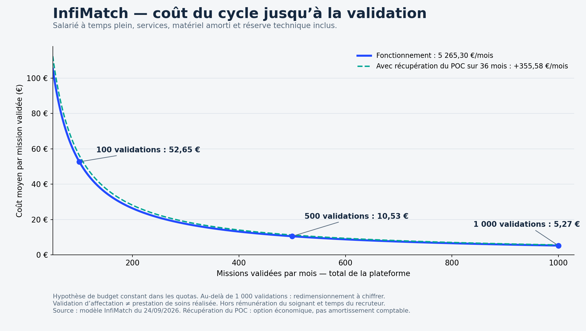

# Coûts détaillés, courbe par cycle et tarifs de marché

Recherche du 24 septembre 2026. Les tarifs concurrents sont des affichages publics, pas des devis obtenus ni des prix effectivement payés par leurs clients. Les prix proposés pour InfiMatch ci-dessous sont des hypothèses commerciales à tester.

## Coût de fonctionnement

Budget technique avec un salarié à temps plein. Services et matériel hors taxes ; salaire en coût employeur. Convention de budget 1 USD = 1 EUR, pas un cours de change constaté. Prix publics et provisions sont distingués.

| Poste | EUR/mois | EUR/an | Hypothèse et source |
| --- | ---: | ---: | --- |
| Vercel Pro | 20,00 | 240,00 | 1 siège déployant, crédit de consommation inclus. [Prix public](https://vercel.com/docs/plans/pro-plan), USD convertis à parité. |
| Supabase Pro | 25,00 | 300,00 | 1 projet Micro, crédit compute déduit. [Prix public](https://supabase.com/pricing), USD convertis à parité. |
| MongoDB Atlas M10 | 58,40 | 700,80 | Prix de départ 0,08 USD/h × 730 h, région à confirmer. [Prix public](https://www.mongodb.com/pricing), USD convertis à parité. |
| n8n Cloud Pro | 50,00 | 600,00 | 10 000 exécutions/mois, facturation annuelle 600 EUR. [Prix public](https://n8n.io/pricing/), EUR convertis à parité. |
| SMTP2GO Starter | 10,00 | 120,00 | 10 000 emails/mois, tarif du corps de la page à confirmer à la commande. [Prix public](https://www.smtp2go.com/pricing/), USD convertis à parité. |
| JobsPipe Builder | 49,00 | 588,00 | 25 000 annonces distinctes/mois ; pas 25 000 missions validées. [Prix public](https://jobspipe.dev/pricing), USD convertis à parité. |
| GitHub Team | 16,00 | 192,00 | 4 utilisateurs × 4 USD ; une organisation payante modélisée. [Prix public](https://github.com/pricing), USD convertis à parité. |
| Hébergement Vault Community | 10,00 | 120,00 | Provision serveur ; architecture cible, aucune migration effectuée. Provision estimative. |
| Sauvegardes externes chiffrées | 10,00 | 120,00 | Provision stockage, transferts à mesurer. Provision estimative. |
| Supervision | 15,00 | 180,00 | Provision outil de surveillance. Provision estimative. |
| Domaine | 1,67 | 20,00 | Provision renouvellement 20 EUR/an. Provision estimative. |
| Salarié de maintenance | 4 851,67 | 58 220,00 | 41 000 EUR brut/an +42 % de charges supposées, [APEC](https://www.apec.fr/tous-nos-metiers/commercial-marketing/chef-de-projet-digital.html). |
| Matériel de maintenance | 55,56 | 666,67 | Un poste 2 000 EUR HT sur 36 mois, réutilisable parmi les quatre postes du POC. |
| Connexion et énergie | 40,00 | 480,00 | Provision pour un poste. |
| Réserve technique | 53,01 | 636,16 | 20 % des abonnements et provisions techniques, pas 20 % du salaire. |
| **Total** | **5 265,30** | **63 183,63** | Dans les quotas du scénario. |

Le salaire représente environ 92,1 % du budget. Charges employeur +42 % supposées, à confirmer suivant le contrat. Le salarié ne constitue pas une astreinte 24 h/24. Le matériel de réalisation est budgété à 8 000 EUR HT d’achat pour quatre postes ; seule la part 133,33 EUR est imputée aux onze jours. Coût de réalisation valorisé : 12 800,98 EUR (travail chargé + matériel), hors abonnements historiques inconnus et majorations horaires éventuelles. Aucun abonnement Figma/IA de développement n’est inclus faute de liste et de factures : ce n’est donc pas un coût exhaustif d’entreprise.

## Courbe et coût moyen du cycle

[Graphique PDF](cout-par-mission.pdf) · [Vectoriel SVG](cout-par-mission.svg) · [Données CSV](cout-par-mission.csv) · [Script reproductible](generate-cost-chart.py)

Un cycle correspond à un besoin publié, une candidature puis une affectation confirmée avec documents et notifications. Il ne prouve pas que la prestation de soins a été réalisée. Le volume est le total de la plateforme, tous établissements confondus. Coût = 5 265,302222 EUR / nombre de validations. À zéro validation, le coût unitaire est indéfini mais les charges demeurent. La deuxième courbe ajoute une récupération économique du coût du POC sur 36 mois (355,58 EUR/mois), option distincte d’un amortissement comptable du logiciel.

| Validations/mois | Coût de fonctionnement par cycle | Avec récupération du POC sur 36 mois |
| ---: | ---: | ---: |
| 50 | 105,31 EUR | 112,42 EUR |
| 100 | 52,65 EUR | 56,21 EUR |
| 200 | 26,33 EUR | 28,10 EUR |
| 250 | 21,06 EUR | 22,48 EUR |
| 300 | 17,55 EUR | 18,74 EUR |
| 500 | 10,53 EUR | 11,24 EUR |
| 750 | 7,02 EUR | 7,49 EUR |
| 1000 | 5,27 EUR | 5,62 EUR |

Courbe limitée à 1 000 validations : les abonnements ne sont pas illimités. À ce volume, le scénario n8n consomme 9 130 exécutions sur 10 000, avec l’hypothèse non mesurée de 8 exécutions/validation, 300 tâches mensuelles et 10 % de reprises. Si seulement 80 % des tentatives aboutissent, les 1 250 tentatives peuvent consommer 11 330 exécutions et le budget doit augmenter. Les frais de paiement, acquisition commerciale, assurance, locaux, marge, salaire du soignant et temps du recruteur sont exclus. Les économies d’échelle ne constituent pas une preuve de capacité ou de rentabilité complète.

## Prix publics observés chez d’autres acteurs

| Acteur et périmètre | Forfait | Facturation à la mission / commission | Lecture et source |
| --- | --- | --- | --- |
| Hublo, accès au logiciel | Prix fixé au contrat, pas de grille publique chiffrée trouvée | Pool : 30 EUR HT par AS, 40 EUR HT par IDE à la réussite | Frais de sourcing du Pool, pas salaire du soignant. Ne pas les présenter comme le prix de tout Hublo. [Pool](https://hublo.com/fr/solutions/remplacements), [conditions financières](https://hublo.com/fr/cgv). |
| Rotafy, planning et remplacement | À partir de 149 EUR HT/mois, suivant taille et organisation | Aucun prix par mission indiqué sur la page consultée | Gestion de planning et de remplacement, pas preuve d’un vivier externe équivalent. [Tarifs](https://rotafy.fr/gestion-remplacement-soignant.html). |
| Vakkin, établissements | 99 / 249 / 499 EUR par mois pour Starter / Pro / Groupe ; accès sans abonnement possible | 10 % par vacation pourvue ; exemple du site : 250 EUR donnent 25 EUR de commission | La FAQ décrit les abonnements comme des options de vivier et RH ; les formules payantes reprennent le socle Free. Fiscalité HT/TTC et assiette exacte à confirmer au devis. Tarifs affichés par un acteur en lancement, pas preuve de traction commerciale. [Tarifs et FAQ](https://vakkin.com/). |
| Mediflash, mise en relation | Pas de forfait chiffré identifié dans les CGU consultées | Pourcentage du prix de prestation, taux non publié dans ces CGU | Commission facturée à l’établissement pour chaque prestation réalisée, regroupée mensuellement. Facturation mensuelle ne signifie pas abonnement fixe. [CGU, 7.2.2](https://mediflash.fr/conditions-generales-d-utilisation/). |
| IDHELP, remplacement libéral IDEL | 19,90 EUR/mois ou 199 EUR/an | Formule Essentiel 9,90 EUR pour une mission ; pas de commission annoncée | Offre pour titulaires libéraux, pas un établissement hospitalier. Le prix « une mission » ne prouve pas une garantie de recrutement au succès. HT/TTC non précisé sur la page. [Prix](https://www.idhelpfrance.fr/). |
| Relevoo, cabinet IDEL | 19,90 EUR TTC/mois ou 199 EUR TTC/an par titulaire | Remplaçants gratuits ; pas de commission chiffrée affichée | Par personne titulaire, pas par cabinet. Inclut notamment organisation et transmissions, donc périmètre différent. [Tarifs](https://www.relevoo.com/tarifs). |

Les offres ne sont pas homogènes et ne permettent pas de calculer une moyenne de marché fiable. On observe bien trois modèles : abonnement, succès/commission, et combinaison des deux. Un pourcentage de rémunération, un prix par publication et un prix par affectation ne sont pas interchangeables. Les prix de soins et d’intérim complet ne sont pas des frais de logiciel comparables.

## Trois pistes InfiMatch à tester, pas des tarifs validés

| Formule proposée HT | Contenu de la proposition | Seuil de couverture du seul budget modélisé |
| --- | --- | --- |
| À l’usage : 19 EUR par affectation confirmée | Pas d’abonnement ; salaire du soignant séparé | 278 validations/mois sur l’ensemble de la plateforme. |
| Forfait : 299 EUR/mois/établissement | Jusqu’à 30 validations par établissement ; au-delà, offre à redimensionner sur devis. Pas d’illimité promis. | 18 établissements payants, dans les capacités et quotas modélisés. |
| Mixte : 149 EUR/mois/établissement +9 EUR par affectation confirmée | Prix fixe réduit et part variable liée à l’usage ; à tester avec des pilotes | Avec 20 établissements payants : 254 validations/mois au total. |

Ce sont des seuils de couverture des 5 265,30 EUR, pas des seuils de rentabilité complets d’entreprise. Ils excluent impayés, TVA collectée, remises, désabonnements et coûts commerciaux non chiffrés. Ne pas soustraire des recettes TTC à des coûts HT. Avec récupération du POC, les seuils deviennent 296 validations à 19 EUR, 19 établissements à 299 EUR, ou 294 validations avec 20 établissements à 149 EUR +9 EUR.

Exemple comparable : **20 établissements et 500 validations/mois**, réparties à 25 chacun pour respecter le forfait de 30.

| Modèle | Chiffre d’affaires HT/mois | Solde après budget modélisé, avant autres coûts |
| --- | ---: | ---: |
| 19 EUR/validation | 9 500,00 EUR | 4 234,70 EUR |
| 299 EUR/établissement | 5 980,00 EUR | 714,70 EUR |
| 149 EUR/établissement +9 EUR/validation | 7 480,00 EUR | 2 214,70 EUR |

Je proposerais de tester la formule mixte, qui stabilise une part des revenus sans facturer toutes les structures comme de gros utilisateurs. La formule à 19 EUR seule reste déficitaire à 100 validations/mois. La volonté de payer doit être vérifiée en pilote : les tarifs concurrents ne prouvent pas que les clients accepteront ces prix pour le POC. Définir contractuellement l’événement facturable, le traitement des annulations et des remboursements avant commercialisation ; aucune facturation n’est implémentée par cette étude.

## Graphiques de rentabilité par proposition

[Analyse et trois formules](RENTABILITE.md) · [Quatre graphiques en PDF](rentabilite-trois-propositions.pdf) · [Classeur modifiable](rentabilite-scenarios.xlsx).

[Comparaison complète CA, coûts, résultat et choix de formule](COMPARAISON_COMPLETE.md) · [Dossier PDF complet](DOSSIER_RENTABILITE_COMPLET.pdf).
