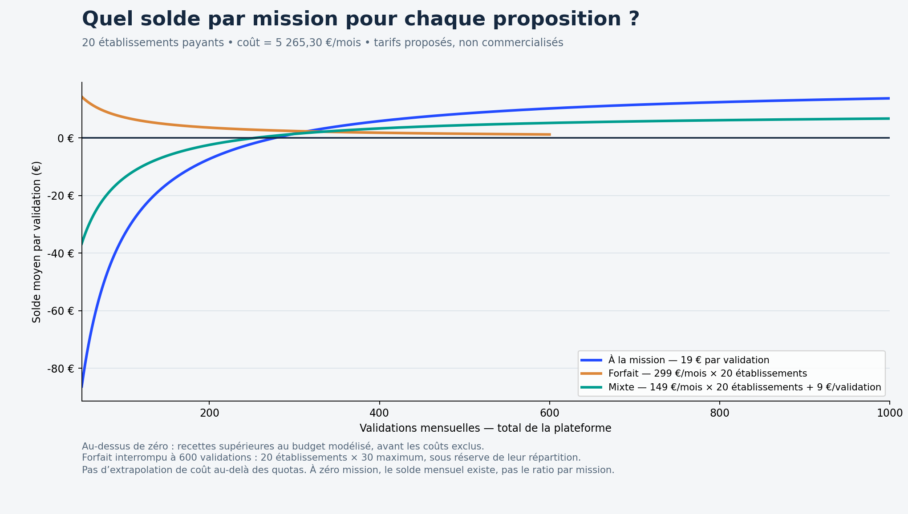
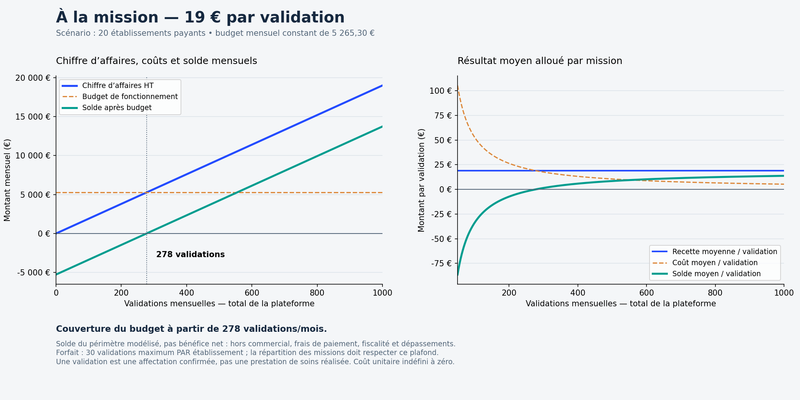
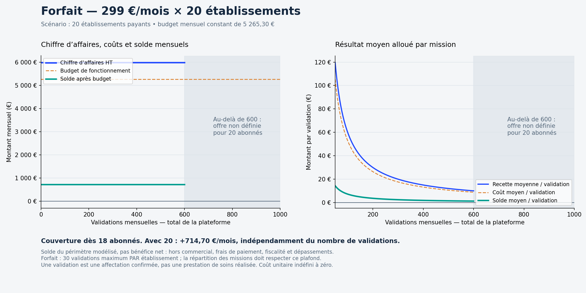
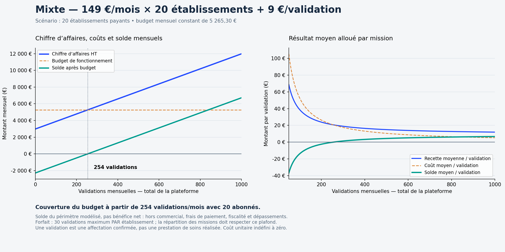

# Rentabilité des trois propositions — scénario du 24/09/2026

Tarifs commerciaux hypothétiques, pas tarifs déjà vendus. Budget constant de **5 265,30 EUR/mois**, dans les quotas. Vingt établissements payants pour les modèles forfait et mixte. Le nombre d’établissements est une hypothèse indépendante du nombre de missions : on ne peut pas déduire un abonnement du seul volume de validations.

La « rentabilité » représentée est le solde des recettes HT après le budget technique et de maintenance défini dans [l’étude](README.md), pas un bénéfice net. Acquisition commerciale, paiement, impayés, fiscalité, rémunération du soignant, temps du recruteur et dépassements ne sont pas inclus. Une validation signifie affectation confirmée, pas réalisation des soins. Aucun paiement ou abonnement réel n’est créé.

[PDF des quatre graphiques](rentabilite-trois-propositions.pdf) · [Classeur modifiable](rentabilite-scenarios.xlsx) · [Données CSV](rentabilite-scenarios.csv) · [Script](generate-profitability.py)

## 1. À la mission : 19 EUR HT

CA = 19 × N. Solde mensuel = 19 × N − 5 265,302222. Solde par mission = 19 − 5 265,302222 / N, pour N > 0.

**Couverture à 278 validations/mois** ; 277 ne suffisent pas. À zéro validation : −5 265,30 EUR/mois, ratio par mission indéfini. Le nombre d’établissements ne change pas directement le CA de cette formule.

## 2. Forfait : 299 EUR HT par établissement et par mois

CA = 299 × E. À 20 établissements, CA = 5 980 EUR et solde = **+714,70 EUR/mois**, pour 0 à 600 validations sous réserve qu’aucun établissement ne dépasse ses 30 validations incluses. Solde moyen = 714,697778 / N pour N > 0.

**Couverture à 18 établissements payants**, pas à un nombre déterminé de missions. À 17 abonnés le solde est −182,30 EUR ; à 18 il est +116,70 EUR. Avoir un faible volume augmente le revenu moyen alloué par mission mais ne crée aucune recette supplémentaire : les abonnements sont supposés effectivement payés. Plus de 600 validations avec vingt abonnés exige une autre offre, non définie ici. Même sous 600, la concentration sur un seul établissement peut dépasser son plafond.

## 3. Mixte : 149 EUR HT par établissement + 9 EUR par validation

CA = 149 × E + 9 × N. À vingt établissements, base = 2 980 EUR/mois. Solde = 9 × N − 2 285,302222. Solde moyen = 9 − 2 285,302222 / N, pour N > 0.

**Couverture à 254 validations/mois avec vingt abonnés** ; 253 ne suffisent pas. À zéro validation, le solde reste négatif : −2 285,30 EUR/mois. Avec seulement dix abonnés, il faut 420 validations ; avec trente, 89 ; avec trente-six, les abonnements seuls couvrent ce budget. Ces variantes ne préjugent pas du coût d’acquisition et de support des clients supplémentaires.

## Comparaison chiffrée à vingt établissements

Dans chaque cellule : solde mensuel / solde moyen par validation. Les coûts utilisent les valeurs non arrondies ; les affichages sont arrondis au centime.

| Validations/mois | À la mission | Forfait | Mixte |
| ---: | ---: | ---: | ---: |
| 100 | -3 365,30 EUR / -33,65 EUR | 714,70 EUR / 7,15 EUR | -1 385,30 EUR / -13,85 EUR |
| 200 | -1 465,30 EUR / -7,33 EUR | 714,70 EUR / 3,57 EUR | -485,30 EUR / -2,43 EUR |
| 300 | 434,70 EUR / 1,45 EUR | 714,70 EUR / 2,38 EUR | 414,70 EUR / 1,38 EUR |
| 500 | 4 234,70 EUR / 8,47 EUR | 714,70 EUR / 1,43 EUR | 2 214,70 EUR / 4,43 EUR |
| 600 | 6 134,70 EUR / 10,22 EUR | 714,70 EUR / 1,19 EUR | 3 114,70 EUR / 5,19 EUR |
| 1000 | 13 734,70 EUR / 13,73 EUR | Hors plafond de cette formule | 6 714,70 EUR / 6,71 EUR |

Le chiffre d’affaires à la mission dépasse celui du forfait à partir de 315 validations ; celui du mixte dépasse le forfait à partir de 334 ; la formule à la mission dépasse le mixte à partir de 299 validations (égalité à 298). Ces comparaisons portent sur les recettes, pas sur l’acceptation commerciale par les clients. Un prix moins cher peut attirer plus de clients : ce comportement n’est pas simulé.

## Investissement initial et quotas

La réalisation valorisée à 12 800,98 EUR n’est pas déduite une deuxième fois du coût mensuel. Si l’on souhaite la récupérer sur 36 mois, ajouter 355,58 EUR/mois au budget et retrancher cette somme de chaque solde mensuel : seuils de 296 validations pour la formule à 19 EUR, 19 abonnés pour le forfait, 294 validations avec vingt abonnés pour le mixte.

Les courbes à l’usage et mixtes s’arrêtent à 1 000 validations, limite du scénario étudié. À ce volume, l’hypothèse n8n de huit exécutions par validation plus les tâches de fond et reprises atteint 9 130/10 000 exécutions. Un taux d’échec accru ou plus de notifications peut dépasser les quotas avant ce volume. Les seuils sont donc indicatifs : coûts variables et volumes doivent être mesurés en pilote.

## Vérification

Assertions du script sur les entiers immédiatement avant/après chaque seuil ; 36 lignes CSV (douze volumes × trois formules), valeurs unitaires absentes à zéro et forfait absent au-delà du plafond. Le classeur expose les coûts, nombre d’établissements et prix en paramètres modifiables ; ses formules sont recalculées à l’ouverture. Les graphiques utilisent les hypothèses par défaut et doivent être régénérés séparément si ces paramètres changent.
