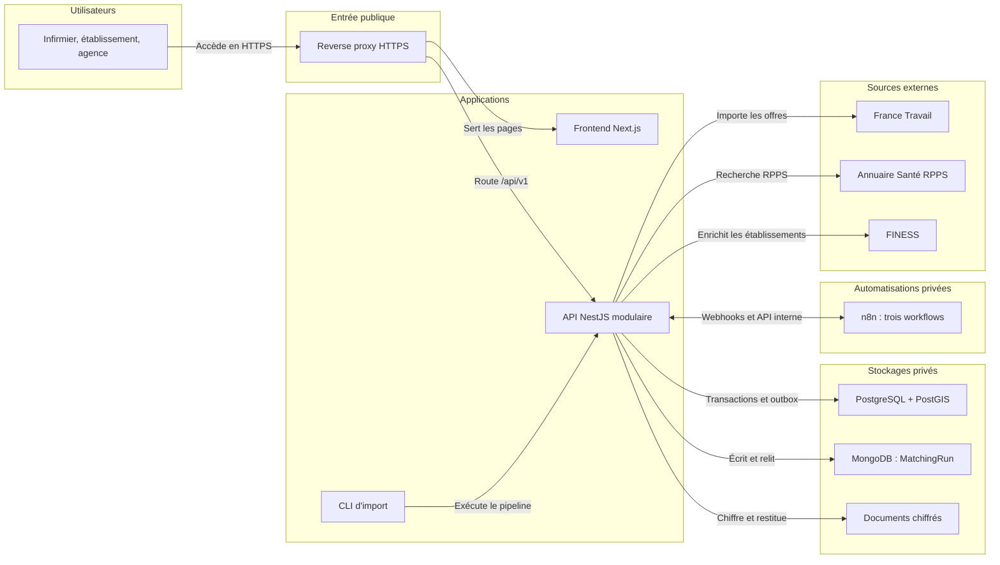

# Schéma d'architecture V1
Architecture cible à implémenter ; aucune infrastructure déployée n'est attestée par ce schéma.

La flèche CLI → API représente l'utilisation des services applicatifs partagés dans un contexte NestJS sans serveur HTTP ; elle n'impose pas un appel HTTP ni un second pipeline. Les connecteurs externes sont les adaptateurs de PublicData et ProfessionalVerification.

Le navigateur appelle /api/v1 via la même origine HTTPS que les pages. Next.js ne possède pas de connexion directe aux bases. Les modules métier restent dans une seule application NestJS.

PostgreSQL contient les utilisateurs, sessions, profils, missions, candidatures, consentements, affectations, notifications, audits, métadonnées de documents et événements d'outbox. PostGIS est une extension de cette même base. MongoDB ne contient que les explications minimisées du matching.

Le distributeur d'outbox fait partie du code backend ; il transmet les événements validés à n8n. n8n appelle des routes internes authentifiées, privées et limitées. Sa persistance technique, distincte de la base métier, n'est pas détaillée dans cette vue simplifiée. Les trois workflows sont : notification de match ; relance ; génération backend d'une confirmation de mission.

Le stockage documentaire est privé, chiffré et accessible via le backend. Les échanges sensibles du déploiement distant sont protégés par TLS ; le dessin ne remplace pas la configuration des certificats.

RPPS : FOUND satisfait la condition RPPS, NOT_FOUND bloque candidature/nouvelle affectation, PENDING maintient en attente. Les autres critères restent contrôlés. Références hors V1 ; attestation V2.

Fichier Mermaid modifiable : [architecture-v1.mmd](architecture-v1.mmd).
Plan du dépôt : [PLAN_ARCHITECTURE_V1.md](PLAN_ARCHITECTURE_V1.md).
Planning : [PLANNING_4_PERSONNES_11_JOURS.md](PLANNING_4_PERSONNES_11_JOURS.md).
